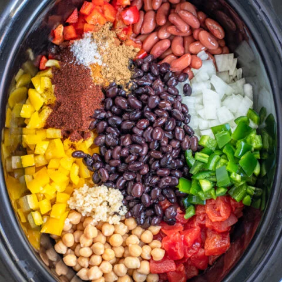

# 3 Bean Vegetarian Chili

**Source:** https://theschmidtywife.com/slow-cooker-vegetarian-chili-recipe/?utm_source=Pinterest&utm_medium=organic
**Author:** Lauren Schmidt
**Yield:** 4
**Prep time:** PT5M
**Cook time:** PT8H
**Total time:** PT8H5M
**Category:** Crockpot
**Cuisine:** American
**Rating:** 4.5 (267 ratings/reviews)

A hearty slow cooker vegetarian chili, made with three different beans and plenty of vegetables. This meatless meal is one that everyone will enjoy, it is full of bold flavors and textures plus it isn't too sweet like many vegetarian chilis.

## Ingredients

- 1 onion
- 2 bell peppers (red & yellow)
- 3 jalapeños
- 1 (28oz) can diced tomatoes
- 1 (15oz) can chickpeas, drained & rinsed
- 1 (15oz) can kidney beans, drained & rinsed
- 1 (15oz) can black beans, drained & rinsed
- 2 teaspoons minced garlic
- 2 tablespoons chili powder
- 1 teaspoon kosher salt
- 1/4 teaspoon cayenne pepper
- 1 teaspoon cumin

## Preparation

1. Dice the onion, bell peppers, and jalapeños. With the jalapeños ensure to remove the seeds and light colored insides, the easiest way to remove the insides and seeds is to cut the jalapeño in half the long way and use a small spoon to scoop everything out, from there dice the green part of the vegetable.
2. Add the diced vegetables, tomatoes, chickpeas, kidney beans, black beans, garlic, chili powder, salt, cayenne, and cumin to the crock of a slow cooker stir to combine.
3. Cook on low 7-8 hours or high 3-4 hours. Serve with garnishes such are sour cream/greek yogurt, cheddar cheese, cilanto, green onions, or any of your favorite chili toppings.

## Nutrition supplied by source

- **Calories:** 233 calories
- **Carbohydrate :** 43 grams carbohydrates
- **Cholesterol :** 0 milligrams cholesterol
- **Fat :** 3 grams fat
- **Fiber :** 13 grams fiber
- **Protein :** 13 grams protein
- **Saturated Fat :** 0 grams saturated fat
- **Serving Size:** 2 cups
- **Sodium :** 706 milligrams sodium
- **Sugar :** 7 grams sugar
- **Trans Fat :** 0 grams trans fat
- **Unsaturated Fat :** 2 grams unsaturated fat

## Tags

Crockpot; American; Slow Cooker Vegetarian Chili Recipe; 3 bean vegetarian chili; three bean vegetarian chili; vegetarian bean chili recipe easy; healthy vegetarian chili
