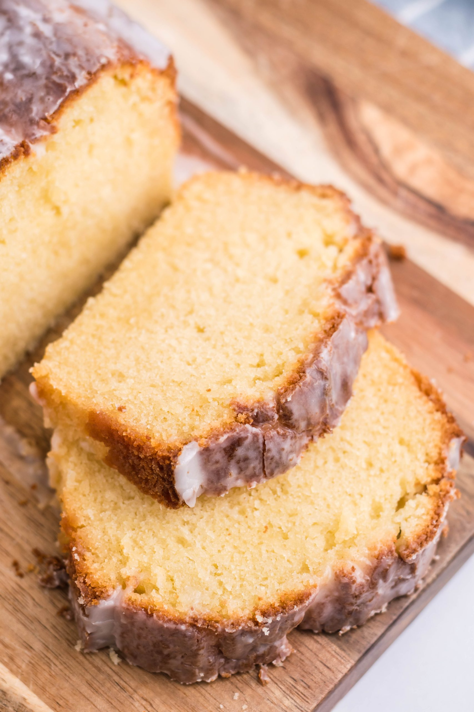

# Apple Cider Pound Cake

**Source:** https://4sonrus.com/apple-cider-pound-cake/?utm_source=Pinterest&utm_medium=organic
**Yield:** ['12']
**Prep time:** PT10M
**Cook time:** PT50M
**Total time:** PT60M
**Category:** ['Breakfast', 'Brunch', 'Dessert', 'Snack']
**Cuisine:** ['American']
**Rating:** 4.79 (19 ratings/reviews)

Apple cider pound cake is a rich buttery treat infused with festive flavor. Perfect for dessert or as sweet breakfast or snack, you'll love making and eating this yummy recipe!

## Ingredients

- 3/4 cup butter (softened)
- 1 1/2 cups sugar
- 3 large eggs
- 1 1/2 cups flour
- 1/4 tsp baking powder
- 1/4 tsp salt
- 1/2 cup apple cider
- 1 cup powdered sugar (sifted)
- 1-2 tbsp apple cider
- pinch cinnamon

## Preparation

### Making The Cake

1. Line a 9x5" loaf pan with parchment paper, with excess hanging over on each side. This will help you remove the pound cake after baking. Set aside.
2. Add the softened butter & sugar to the bowl of a stand mixer, and cream together until the mixture's light & fluffy.
3. Add the cracked eggs, one at a time, to the mixture- beating until completely incorporated after each egg is added.
4. In a separate mixing bowl, add the remaining dry ingredients and whisk them together until combined.
5. Add some of the dry mixture, followed by the cider, mixing well after each addition until they're all evenly combined.
6. Spray the parchment paper lined loaf pan liberally with non stick cooking spray, and then transfer the batter to the pan.
7. After you've added the batter, drop the dish on the counter 1-2 times to force any air bubbles to the surface.
8. Bake the pound cake at 350° for 40-50 minutes, or until a butter knife inserted in the center comes out clean.
9. Let the cake cool for 10-15 minutes. Run a clean knife around any sides touching the loaf pan to release, then pull up on the parchment paper flaps to cleanly remove the cake from the dish.
10. Transfer the cake to a wire cooling wrack, and let it rest until cooled completely.
### Making The Glaze

11. Add the powdered sugar & cider to a mixing bowl. Whisk them together until the mixture's smooth & evenly combined.
12. Pour the glaze evenly out over the completely cooled cake.
13. Let the glaze set up, then slice & serve.

## Nutrition supplied by source

- **Calories:** 317 kcal
- **Carbohydrate :** 48 g
- **Protein :** 3 g
- **Fat :** 13 g
- **Saturated Fat :** 8 g
- **Trans Fat :** 1 g
- **Cholesterol :** 77 mg
- **Sodium :** 169 mg
- **Fiber :** 1 g
- **Sugar :** 36 g
- **Unsaturated Fat :** 4 g
- **Serving Size:** 1 serving

## Tags

['Breakfast', 'Brunch', 'Dessert', 'Snack']; ['American']; apple cider dessert; easy pound cake; glazed pound cake; pound cake recipe; recipe using apple cider
