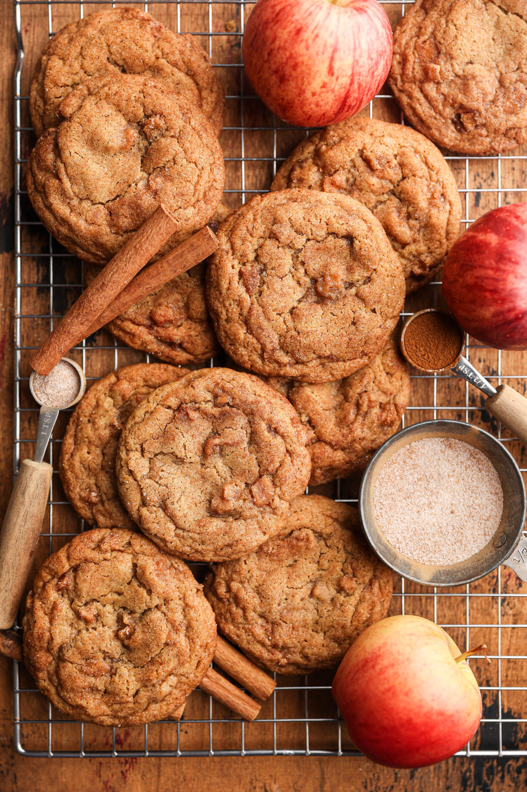

# Apple Snickerdoodles

**Source:** https://sturbridgebakery.com/apple-snickerdoodles/?utm_source=Pinterest&utm_medium=organic
**Prep time:** PT25M
**Cook time:** PT15M
**Total time:** PT215M
**Category:** ['Dessert']
**Rating:** 5 (3 ratings/reviews)

These apple snickerdoodles combine the cozy fall flavors of brown butter, warm cinnamon, and caramelized apples. The gooey warm apples inside a chewy, cinnamon sugar-coated snickerdoodle makes these an addicting treat to get you into the fall baking mood!

## Ingredients

- 250 grams peeled and finely diced gala apples (about 4-5 small apples)
- 50 grams dark brown sugar
- 1 1/2 teaspoons ground cinnamon
- pinch of salt
- lemon juice from one small lemon
- 184 grams unsalted butter (European-style preferred) (browed to 150 grams (approximately 3/4 cup)* see notes)
- 100 grams dark brown sugar
- 100 grams granulated sugar
- 2 teaspoons vanilla bean paste or extract
- 1 egg (room temperature)
- 1 egg yolk (room temperature)
- 250 grams all purpose flour
- 1 teaspoon baking soda
- 1 teaspoon cream of tartar
- 1 teaspoon ground cinnamon
- 1/2 teaspoon fine sea salt
- 5 grams cornstarch
- 66 grams granulated sugar
- 1 tablespoon ground cinnamon

## Preparation

1. Peel & finely dice the apples. Toss them together with the dark brown sugar, cinnamon, salt, and lemon juice until combined. Heat the apples on the stove and cook them down until browned & caramelized. About 10 minutes over low-medium heat. Set aside in the fridge to chill.
2. Melt the butter in a pot over medium heat. Once completely melted, the butter will crack/sizzle for a few minutes. Let it do this while stirring occasionally. Once the butter stops rapidly bubbling, it will begin to foam up in the pan. Gently stir until you can see golden milk solids floating in the butter & the butter is golden brown. Remove from the heat & pour the butter into a different container. Cool in the fridge for 10 minutes.
3. Whisk together the flour, baking soda, cream of tartar, cinnamon, salt, and cornstarch. Set aside.
4. Separately, whisk together the cooled brown butter, dark brown sugar, granulated sugar, and vanilla until combined. Add the egg and egg yolk and whisk until smooth. Add the cooled caramelized apples and gently fold until evenly incorporated.
5. Add the dry ingredients to the wet ingredients and gently fold until the flour has just mixed in and a dough forms. Tightly cover and chill the dough for 2-3 hours.
6. Once the dough has chilled, preheat the oven to 350F and line a baking sheet with parchment paper. In a small bowl, whisk together the granulated sugar and ground cinnamon for the coating.
7. Use a cookie scoop and roll the dough in the cinnamon sugar until generously coated. I used a 1.125 oz cookie scoop, approximately 40 grams or 2 heaping tablespoons. Space the cookies 2-3 inches apart on the baking sheet.
8. Bake for 12-14 minutes until the edges are set and golden brown but the tops are puffy and slightly underdone. They will continue baking on the pan once removed from the oven.
9. Let cool on the baking sheet for 5 minutes before transferring to a cooling rack to cool completely or enjoy slightly warm!

## Tags

['Dessert']; Cookies
