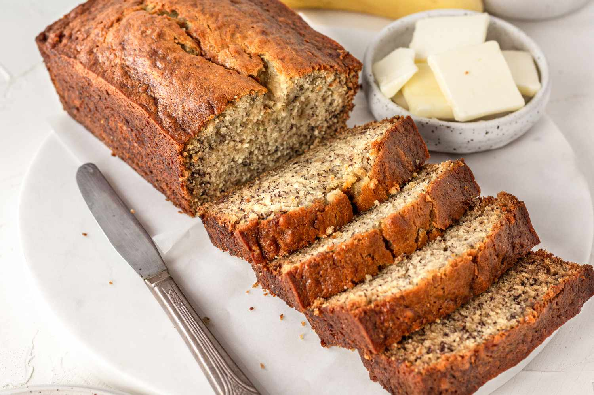

# Banana Bread

**Source:** https://www.simplyrecipes.com/recipes/banana_bread/
**Author:** Elise Bauer
**Yield:** ['10', '1 loaf']
**Prep time:** PT10M
**Cook time:** PT60M
**Total time:** PT70M
**Category:** ['Dessert', 'Baking', 'Banana', 'Quick Bread']
**Cuisine:** ['American']
**Rating:** 4.8 (2160 ratings/reviews)

Put those ripe bananas to use in the best banana bread recipe ever. Moist and delicious, it’s easy to make—one bowl, no need for a mixer!

## Ingredients

- 2 to 3 very ripe bananas, peeled (about 1 1/4 to 1 1/2 cups mashed)
- 1/3 cup melted butter, unsalted or salted
- 1 teaspoon baking soda
- Pinch of salt
- 3/4 cup sugar (1/2 cup if you would like it less sweet, 1 cup if more sweet)
- 1 large egg, beaten
- 1 teaspoon vanilla extract
- 1 1/2 cups of all-purpose flour

## Preparation

1. Butter an 8x4-inch loaf pan.
2. In a mixing bowl, mash the ripe bananas with a fork until completely smooth. Stir the melted butter into the mashed bananas.
3. Mix in the baking soda and salt. Stir in the sugar, beaten egg, and vanilla extract. Mix in the flour.
4. Pour the batter into your prepared loaf pan. Bake for 55 to 65 minutes at 350°F (175°C), or until a toothpick or wooden skewer inserted into the center comes out clean. A few dry crumbs are okay; streaks of wet batter are not. If the outside of the loaf is browned but the center is still wet, loosely tent the loaf with foil and continue baking until the loaf is fully baked.
5. Remove from oven and let cool in the pan for a few minutes. Then remove the banana bread from the pan and let cool completely before serving. Slice and serve. (A bread knife helps to make slices that aren’t crumbly.) Wrapped well, the banana bread will keep at room temperature for 4 days. For longer storage, refrigerate the loaf up to 5 days, or freeze it .
6. Enjoy!

## Nutrition supplied by source

- **Calories:** 220 kcal
- **Carbohydrate :** 37 g
- **Cholesterol :** 35 mg
- **Fiber :** 1 g
- **Protein :** 3 g
- **Saturated Fat :** 4 g
- **Sodium :** 85 mg
- **Sugar :** 19 g
- **Fat :** 7 g
- **Trans Fat :** 0 g
- **Unsaturated Fat :** 2 g

## Tags

['Dessert', 'Baking', 'Banana', 'Quick Bread']; ['American']; Baking; Banana; Quick Bread; American
