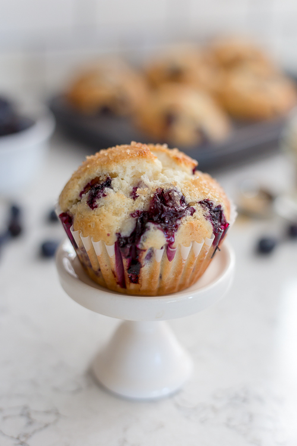

# Blueberry Sour Cream Muffins

**Source:** https://farmettekitchen.com/blueberry-sour-cream-muffins/?utm_source=Pinterest&utm_medium=organic
**Author:** Emily Bruno
**Yield:** ['6', '6 muffins']
**Prep time:** PT5M
**Cook time:** PT20M
**Total time:** PT30M
**Category:** ['Breakfast']
**Cuisine:** ['American']

Blueberry Sour Cream Muffins that are moist, tangy, and bursting with blueberries. Sprinkle these muffins with coarse sugar for a delicious bakery-style breakfast at home.

## Ingredients

- 1 cup flour
- 1/4 tsp baking soda
- 1/4 heaping tsp salt
- 1 egg
- 1/2 cup granulated sugar
- 1/4 cup vegetable oil
- 1/2 tsp vanilla extract
- 1/2 cup sour cream
- 3/4 cup fresh blueberries
- Turbinado sugar

## Preparation

1. Preheat oven to 375 degrees. Line muffin tin with six paper liners.
2. Stir together flour, baking soda, and salt. Set aside.
3. Whisk the egg continuously while gradually adding the sugar.
4. Continue whisking while slowly pouring in the oil until the mixture is well combined.
5. Whisk in the vanilla.
6. Add flour mixture alternately with the sour cream.
7. Gently fold in the blueberries.
8. Scoop the batter into the prepared muffin tin, filling each cup nearly full.
9. Sprinkle with turbinado sugar.
10. Bake for 20-25 minutes or until a toothpick inserted in centers comes out clean.
11. Cool in pan for 5 minutes before transferring to a wire rack to cool completely.

## Nutrition supplied by source

- **Serving Size:** 1 g
- **Calories:** 275 kcal
- **Carbohydrate :** 34 g
- **Protein :** 4 g
- **Fat :** 14 g
- **Saturated Fat :** 3 g
- **Cholesterol :** 42 mg
- **Sodium :** 168 mg
- **Fiber :** 1 g
- **Sugar :** 18 g
- **Unsaturated Fat :** 10 g

## Tags

['Breakfast']; ['American']; blueberry muffins; muffin
