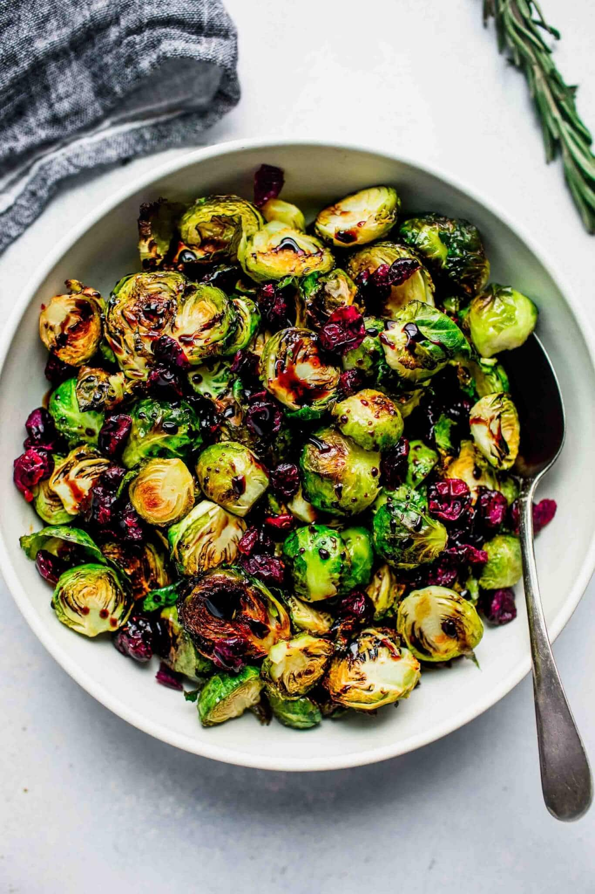

# Brussel Sprouts with Balsamic Reduction

**Source:** https://www.platingsandpairings.com/roasted-brussels-sprouts-balsamic/?utm_source=Pinterest&utm_medium=organic
**Yield:** ['8', '8 servings']
**Prep time:** PT10M
**Cook time:** PT30M
**Total time:** PT40M
**Category:** ['Side Dish']
**Cuisine:** ['American']
**Rating:** 5 (27 ratings/reviews)

These Roasted Brussels Sprouts with Balsamic Reduction & Cranberries make a simple and elegant side dish that both kids and adults love!

## Ingredients

- 3 pounds Brussels sprouts
- 1/3 cup olive oil
- 1 cup brown sugar
- 3/4 cup balsamic vinegar
- 1 cup dried cranberries

## Preparation

1. Preheat oven to 400 degrees.
2. Cut off the brown ends of the Brussels sprouts and cut in half. Mix them in a bowl with the olive oil. Pour them on two baking sheets and roast for 25-30 minutes, until crisp on the outside and tender on the inside.
3. Meanwhile, combine the balsamic vinegar and brown sugar in a saucepan. Bring to a boil, then reduce the heat to medium-low and simmer until glaze is thick and syrupy, about 20 minutes.
4. Drizzle the balsamic reduction over the roasted sprouts. Sprinkle with dried cranberries and serve immediately.

## Nutrition supplied by source

- **Calories:** 356 kcal
- **Carbohydrate :** 56 g
- **Protein :** 5 g
- **Fat :** 14 g
- **Saturated Fat :** 1 g
- **Sodium :** 48 mg
- **Fiber :** 7 g
- **Sugar :** 42 g
- **Serving Size:** 1 serving

## Tags

['Side Dish']; ['American']; brussels sprouts
