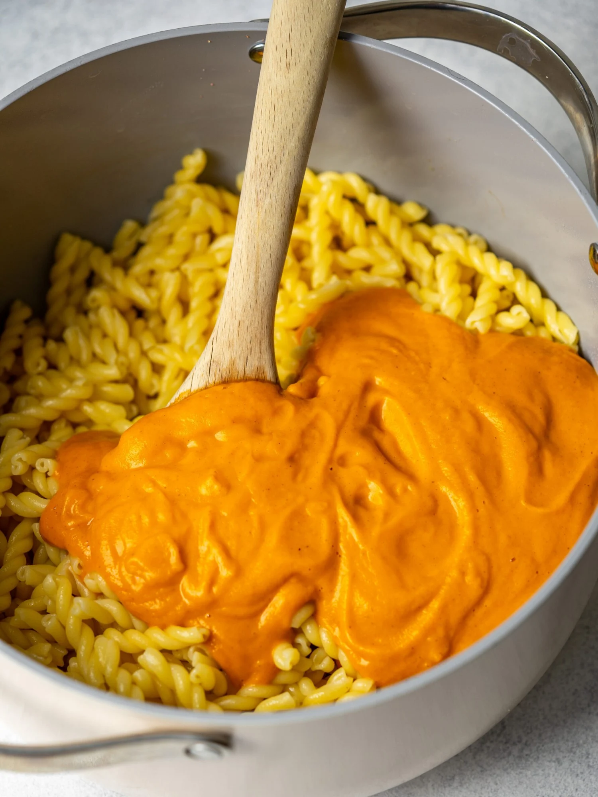

# Butternut Squash Pasta Sauce

**Source:** https://madaboutfood.co/butternut-squash-pasta-sauce/?utm_source=Pinterest&utm_medium=organic
**Yield:** ['6', '6 servings']
**Prep time:** PT10M
**Cook time:** PT30M
**Category:** ['Dinner']
**Cuisine:** ['American']
**Rating:** 4.93 (51 ratings/reviews)

A creamy vegan butternut squash pasta sauce made with simple healthy ingredients.

## Ingredients

- 16 oz bag of frozen diced butternut squash
- 1.5 cups fresh chopped tomatoes
- 1/2 yellow onion
- 2 tbsp olive oil
- 1 tsp salt
- 1/4 tsp black pepper
- 1/2 tsp dried thyme
- 1 lb pasta
- 1/3 cup pasta water reserved from cooked pasta

## Preparation

1. Preheat oven to 450F and line a baking sheet with parchment paper
2. Place frozen cubed butternut squash, chopped tomatoes and sliced onion on the baking sheet
3. Drizzle olive oil on top and season with salt, pepper, and thyme
4. Mix to cover the vegetables evenly with oil and seasonings
5. Bake at 450F for 20 minutes
6. While the veggies bake, cook the pasta according to package instructions
7. Before you drain the cooked pasta reserve 1/3 cup of the pasta water and place in a blender
8. Take the cooked veggies hot from the oven and blend with the pasta water until a smooth sauce remains
9. Pour the sauce over the cooked pasta and toss to coat
10. Serve immediately with parmesan cheese or plant based parm

## Nutrition supplied by source

- **Serving Size:** 6 g
- **Calories:** 367 kcal
- **Sugar :** 5 g
- **Sodium :** 398 mg
- **Fat :** 6 g
- **Saturated Fat :** 1 g
- **Carbohydrate :** 68 g
- **Fiber :** 5 g
- **Protein :** 11 g
- **Unsaturated Fat :** 5 g

## Tags

['Dinner']; ['American']; butternut squash pasta sauce; creamy vegan pasta sauce; healthy butternut squash pasta
