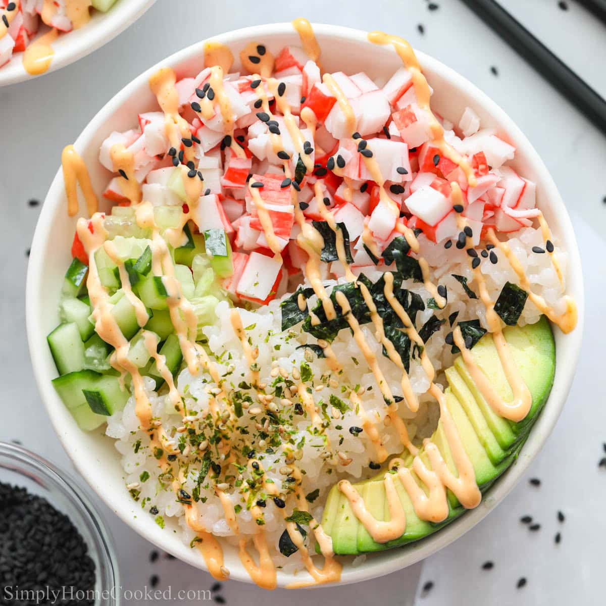

# California Sushi Bowls

**Source:** https://simplyhomecooked.com/california-roll-sushi-bowls/?utm_source=Pinterest&utm_medium=organic
**Yield:** ['4', '4 Bowls']
**Prep time:** PT8M
**Cook time:** PT15M
**Total time:** PT23M
**Category:** ['Appetizer', 'Main Course']
**Cuisine:** ['Asian', 'Japanese']
**Rating:** 5 (31 ratings/reviews)

California Sushi Bowls are so easy to make & taste amazing. Enjoy tender crab, tangy sushi rice & fresh veggies in this light, flavorful dish.

## Ingredients

- 1 1/2 cups dry Calrose Sushi Rice
- 2 cups water
- 1/4 cup seasoned rice vinegar (Marukan)
- 1/4 cup Japanese mayonnaise
- 2 teaspoons sriracha
- 8 oz imitation crab chopped into small pieces
- 1/2 cup diced English cucumber
- 1-2 nori sheets (chopped or crumbled into small pieces (add more if you'd like))
- 1 large avocado (peeled and sliced)
- Black and toasted sesame seeds (for garnish)
- 1/4 cup low-sodium soy sauce (for serving)
- Nori Furikake

## Preparation

1. Start off by rinsing 1 1/2 cups of sushi rice in a mesh sifter. Once the rice is well rinsed, add it to your rice cooker along with 2 cups of water. Then turn on the rice cooker.
2. Once the rice is cooked transfer it to a rimmed baking sheet.
3. Then pour 1/4 cup seasoned rice vinegar over the rice and fold it in. You want to use a rice paddle to do this. Make sure be gentle with the rice and not mash it up. Then let the rice cool completely.
4. Then make your spicy Mayo by combining 1/4 cup Japanese mayonnaise with 2 teaspoons sriracha.
5. Now chop cup 8 ounces of leg style imitation crab meat and 1/2 cup of English cucumber. You can also break up a few pieces of Nori (dried seaweed).
6. Now add the cooled sushi rice to a bowl, along with the chopped crab, cucumber, and sliced avocado. Then drizzle on the spicy mayonnaise, and top with chopped nori, sesame seeds, and furikake.

## Nutrition supplied by source

- **Calories:** 402 kcal
- **Carbohydrate :** 73 g
- **Protein :** 10 g
- **Fat :** 18 g
- **Saturated Fat :** 3 g
- **Trans Fat :** 1 g
- **Cholesterol :** 12 mg
- **Sodium :** 1007 mg
- **Fiber :** 6 g
- **Sugar :** 3 g
- **Serving Size:** 1 serving

## Tags

['Appetizer', 'Main Course']; ['Asian', 'Japanese']; sushi bowls
