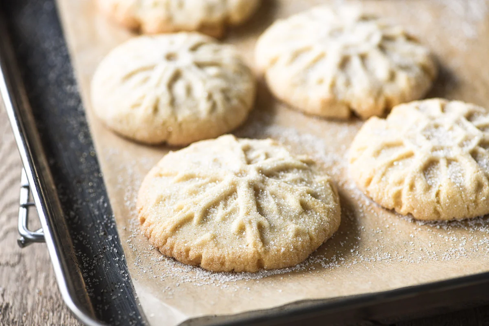

# Cardamom Sugar Cookies

**Source:** https://theviewfromgreatisland.com/cardamom-sugar-cookies/?utm_source=Pinterest&utm_medium=organic
**Yield:** ['1.5', '1.5 dozen']
**Prep time:** PT15M
**Cook time:** PT14M
**Total time:** PT29M
**Category:** ['Dessert']
**Cuisine:** ['American']
**Rating:** 4.83 (23 ratings/reviews)

Simple cardamom sugar cookies made special with a snowflake cookie stamp!

## Ingredients

- 1 cup unsalted butter, at room temperature
- 1/2 cup sugar (you can also use confectioner's sugar which will give you a fluffier texture to your cookie.)
- 1 1/2 tsp ground cardamom (if you do not like, or do not have cardamom, you can use cinnamon or another spice you like.)
- 1 tsp vanilla extract
- 1/4 tsp kosher salt
- 2 cups plus 2 tablespoons all purpose flour

## Preparation

1. Preheat oven to 375F
2. Cream the butter, sugar, cardamom, vanilla, and salt in a stand mixer or with electric beaters. You can also do this by hand.
3. Gradually add in the flour, with the mixer on low, until all the flour is incorporated and the dough comes together.
4. Use a medium (2 tablespoon) cookie scoop to portion out the dough. Roll the dough into balls and coat in granulated sugar.
5. Stamp the balls of dough with your cookie stamp (see post for tips.) Gently pry it off the cookie stamp by just nudging one corner. The cookie should come right off the stamp. Sprinkle your stamped cookies with a little more granulated sugar.
6. Place the tray of cookies in the freezer for 15 minutes.
7. Place the cold cookies onto a fresh parchment lined baking sheet, leaving 2 inches between cookies.
8. Bake 14-16 minutes until just starting to turn faintly golden around the very edges. The cookies will still be quite pale. Note: cold cookies will take slightly longer than room temp cookie dough, and ovens and pans vary greatly. Bake less for softer cookies and longer for crunchier cookies.
9. Let the cookies cool on a rack.

## Nutrition supplied by source

- **Calories:** 164 kcal
- **Carbohydrate :** 16 g
- **Protein :** 2 g
- **Fat :** 10 g
- **Saturated Fat :** 7 g
- **Trans Fat :** 0.4 g
- **Cholesterol :** 27 mg
- **Sodium :** 34 mg
- **Fiber :** 0.4 g
- **Sugar :** 6 g
- **Unsaturated Fat :** 3.4 g
- **Serving Size:** 1 serving

## Tags

['Dessert']; ['American']; baking; cardamom; Christmas; cookies; holidays; snowflake; winter
