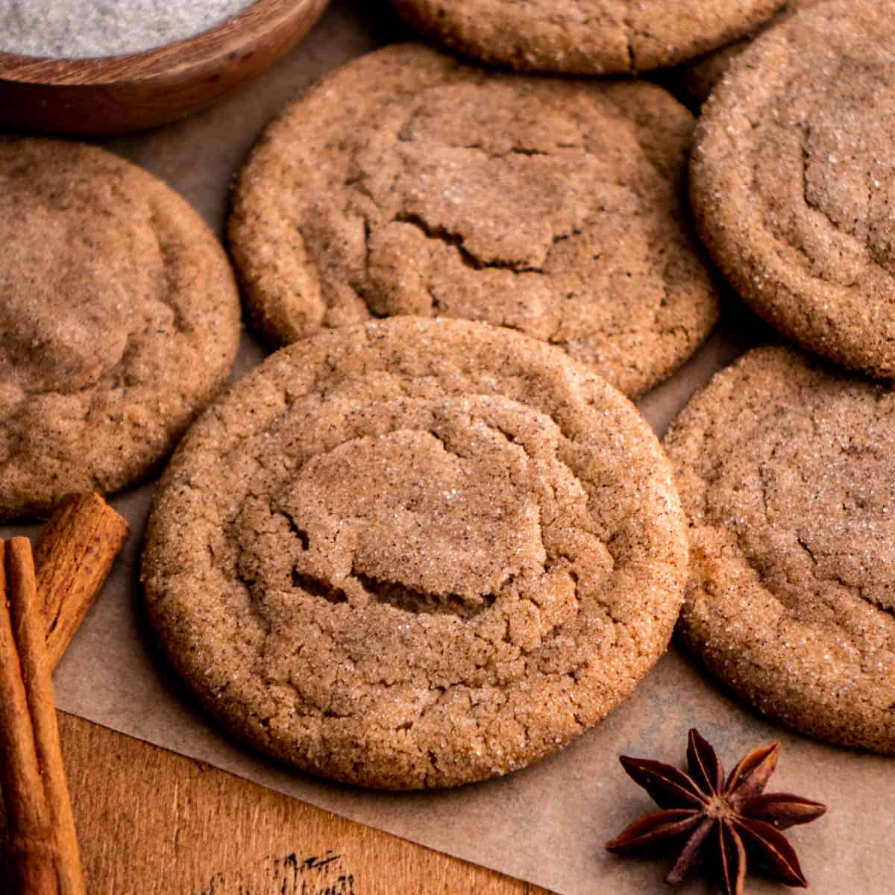

# Chai Cookies

**Source:** https://inbloombakery.com/chai-cookies/?utm_source=Pinterest&utm_medium=organic
**Author:** Ginny Dyer
**Yield:** ['22', '22 cookies']
**Prep time:** PT30M
**Cook time:** PT11M
**Category:** ['Dessert']
**Rating:** 4.94 (319 ratings/reviews)

These are the best chai cookies! They are super chewy cookies, made with warm fall spices and brown butter, and rolled in spiced sugar. They're the perfect cookie for fall and the Christmas holiday season!

## Ingredients

- 6 tbsp (75 g) granulated white sugar
- 1/2 tsp ground cinnamon
- 1/4 tsp ground ginger
- 1/8 tsp ground allspice
- 1/8 tsp ground nutmeg
- 1/4 tsp ground cardamom
- pinch of ground cloves
- 1 1/4 cups (280 g) unsalted butter
- 2 cups (250 g) all purpose flour, spooned and leveled
- 1 tbsp ground cinnamon
- 1 1/2 tsp ground ginger
- 1/2 tsp ground allspice
- 1/2 tsp ground nutmeg
- 1 tsp ground cardamom
- 1/4 tsp ground cloves
- 1/2 tsp baking powder
- 1/2 tsp baking soda
- 1/2 tsp salt
- 1 1/4 cups (275 g) light brown sugar
- 4 egg yolks, at room temprature
- 2 tsp vanilla
- 1/2 tbsp heavy cream
- 1/2 tbsp molasses

## Preparation

### For the Spiced Sugar

1. Add the granulated white sugar, cinnamon, ginger, allspice, nutmeg, cardamom and cloves to a bowl. Whisk to combine.
### For the Chai Cookies

2. Add the butter to a pot and heat it over medium heat. Allow the butter to melt and come to a simmer. Simmer until the butter is foamy, giving off a nutty scent and has browned. The whole process should take about 5-8 minutes. Remove the butter from the heat and transfer it to a small bowl. Pop it in the fridge and allow it to cool completely until it is solid but still malleable.
3. Preheat the oven to 350 degrees F. Line two baking sheets with parchment paper and set aside.
4. In a medium bowl, whisk together the flour, cinnamon, ginger, allspice, nutmeg, cardamom, cloves, baking soda, baking powder and salt. Then set aside the flour mixture.
5. In a large bowl whip the cooled brown butter with an electric mixer on high speed until it is fluffy, about 1 minute. Then add in the brown sugar and mix on high speed until creamed together, about 2 minutes. (You can also use the bowl of a stand mixer fit with a paddle attachment.)
6. Add in the egg yolks, vanilla, heavy cream and molasses and mix for one minute on medium speed until pale and fluffy. Scrape the sides of the bowl as necessary.
7. Add the dry ingredients to the wet ingredients and combine on low speed.
8. Scoop the dough into 22 portions with a 2 tbsp cookie scoop, then roll into balls. Roll the cookie dough balls in the spiced sugar mixture.
9. Transfer the cookie dough to a parchment paper lined baking sheet. Bake 8 cookies at a time, for 11- 12 minutes.
10. Let the cookies cool for 5 minutes on the cookie sheet, then transfer the baked cookies to a wire rack to cool completely. Then serve!

## Tags

['Dessert']; chai; chai cookies; cookie recipe; Cookies; fall recipes
