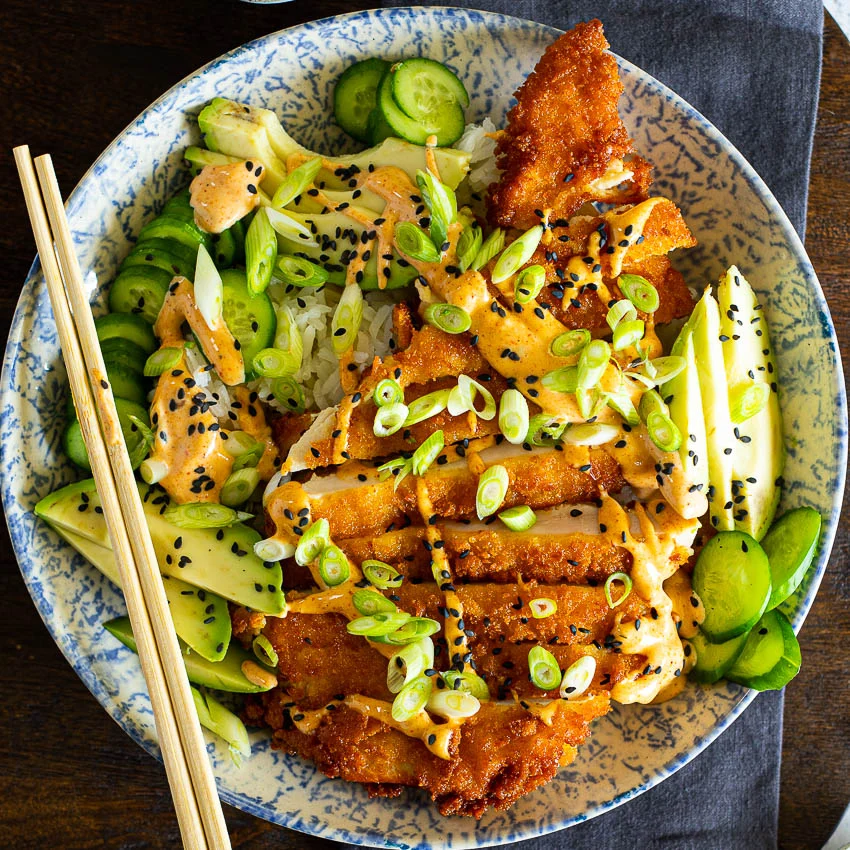

# Chicken Katsu Bowls

**Source:** https://simply-delicious-food.com/easy-chicken-katsu-bowls-curry-mayo/?utm_source=Pinterest&utm_medium=organic#recipe
**Author:** Alida Ryder
**Yield:** ['4']
**Prep time:** PT20M
**Cook time:** PT15M
**Total time:** PT35M
**Category:** ['Dinner']
**Cuisine:** ['American', 'Japanese']
**Rating:** 4.84 (6 ratings/reviews)

Crispy chicken katsu rice bowls served with avocado, cucumber and a delicious spicy curry mayo is a guaranteed dinner favorite.

## Ingredients

- 4 chicken breasts
- 1 cup flour (seasoned with 1 tsp salt)
- 2 eggs (beaten)
- 2 cups panko breadcrumbs (seasoned with 1 tsp salt)
- 2 tsp salt
- ¼ cup mayonnaise
- ¼ cup plain yogurt
- 1 tbsp curry powder
- 1 tsp honey
- 1 tsp rice vinegar
- 2-3 tsp sriracha
- 4 cups cooked rice
- 1 avocado (sliced)
- sliced cucumber
- green onion/spring onion
- sesame seeds

## Preparation

1. Slice the chicken breasts in half, creating two thin cutlets.
2. Season the flour with salt and pepper and do the same with the breadcrumbs.
3. Coat the chicken first in the seasoned flour, then beaten egg and finally in the panko breadcrumbs.
4. Heat enough oil to deep fry the chicken in a pot or deep skillet.
5. Fry the chicken in hot oil until crisp, golden brown and cooked through.
6. Combine all the sauce ingredients in a small bowl and mix well. Taste and adjust seasoning if necessary.
7. Slice the chicken then serve over the cooked rice with cucumber and avo.
8. Drizzle over the sauce and garnish with spring onion/green onion and sesame seeds.

## Nutrition supplied by source

- **Calories:** 614 kcal
- **Carbohydrate :** 78 g
- **Protein :** 40 g
- **Fat :** 15 g
- **Saturated Fat :** 3 g
- **Trans Fat :** 0.02 g
- **Cholesterol :** 164 mg
- **Sodium :** 1628 mg
- **Fiber :** 6 g
- **Sugar :** 6 g
- **Unsaturated Fat :** 9 g
- **Serving Size:** 1 serving

## Tags

['Dinner']; ['American', 'Japanese']; Chicken katsu; chicken katsu bowls; Chicken katsu recipe
