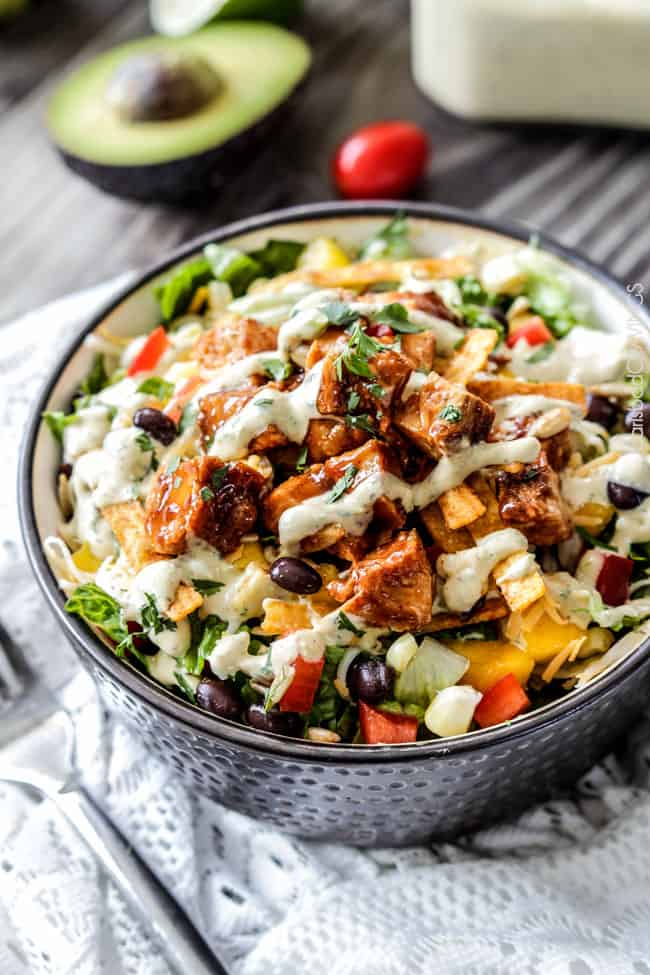

# Chipotle BBQ Chicken Salad with Tomatillo Avocado Ranch

**Source:** https://carlsbadcravings.com/chipotle-bbq-chicken-salad-with-tomatillo-avocado-rach-dressing-recipe/?utm_source=Pinterest&utm_medium=organic
**Yield:** ['8']
**Prep time:** PT20M
**Cook time:** PT15M
**Total time:** PT35M
**Rating:** 5 (1 ratings/reviews)

Chipotle BBQ Chicken Salad with Tomatillo Avocado Ranch is WAY better than your favorite restaurant salad at a fraction of the cost tossed with tender chipotle barbecue chicken and the most intoxicating dressing EVER! This BBQ Chicken Salad is is Ah-mazing! I was going for a CPK Copycat but I think your taste buds will agree this salad is even better!

## Ingredients

- 1 Recipe Easy Chipotle Chicken
- 1/4 cup sweet barbecue sauce
- 1 Recipe 5 Minute Blender Tomatillo Avocado Ranch
- 1 large head romaine lettuce chopped, about 8 cups
- fresh corn kernels from 1 ear of corn
- 1/2 cup jicama, peeled and chopped (optional)
- 1/2 cup grape tomatoes, halved
- 3/4 cup black beans,, drained and rinsed
- 1 mango, chopped
- 1 red bell pepper, chopped
- 1/4 red onion, thinly sliced
- 1/2 cup roasted and salted sunflower seeds
- 3/4 cup shredded sharp cheddar cheese
- 1/2 cup shredded Monterey jack cheese
- tortilla strips

## Preparation

1. Prepare 5 Minute Blender Tomatillo Ranch according to directions. Best chilled before serving.
2. Prepare Chipotle Chicken according to directions. Chop cooked chicken into bite size pieces and toss with 1/4 cup barbecue sauce or enough to generously coat.
3. To assemble, add the Salad Ingredients, chicken, cheese and sunflower seeds to a large bowl and toss to combine. Garnish individual servings with tortilla strips and drizzle with dressing.

## Tags

[Add personal tags]
