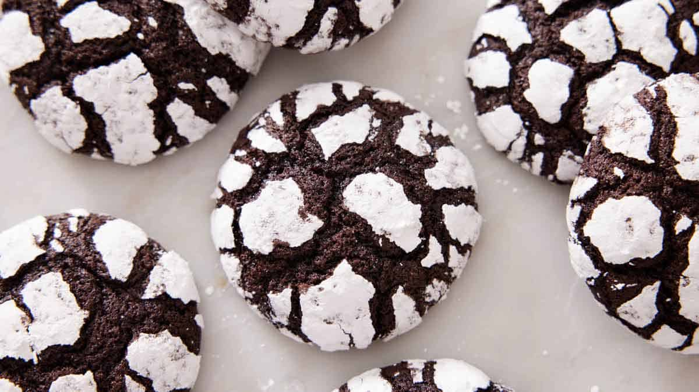

# Chocolate Crinkle Cookies

**Source:** https://preppykitchen.com/chocolate-crinkle-cookies/
**Yield:** ['48', '48 cookies']
**Prep time:** PT15M
**Cook time:** PT10M
**Total time:** PT265M
**Category:** ['Dessert']
**Cuisine:** ['American']
**Rating:** 4.97 (1107 ratings/reviews)

Rich and fudgy Chocolate Crinkle Cookies are as fun to make as they are delicious and indulgent! Made using pantry staples and simple steps, these cookies are perfect to bake for the holidays or any time the craving hits.

## Ingredients

- 1 cup unsweetened cocoa powder ((100g))
- 1¾ cups granulated sugar ((350g))
- ½ cup vegetable oil ((120mL))
- 4 large eggs (room temperature)
- 2 teaspoons vanilla extract
- 2 cups all-purpose flour ((240g))
- 2 teaspoons baking powder
- ¾ teaspoon salt
- 1 cup powdered sugar ((120g))

## Preparation

1. In a large mixing bowl using a hand mixer or the bowl of a stand mixer fitted with the paddle attachment, combine the sugar, cocoa powder, and oil. Beat on medium speed until well combined and shiny.
2. Add the eggs one at a time, beating until well combined. Beat in the vanilla.
3. Combine the flour, baking powder, and salt in a medium bowl, stirring to combine. Add the flour mixture to the cocoa mixture and mix on low speed just until combined.
4. Cover the dough in plastic wrap and refrigerate for at least 4 hours or up to overnight.
5. Once the dough has chilled, preheat oven to 350°F. Line two large baking sheets with parchment paper. Place the powdered sugar in a small bowl.
6. Using a small ice cream scoop or tablespoon, scoop the chilled dough and roll into roughly one-inch balls. Roll the dough balls in powdered sugar until well coated and place on the prepared baking sheet about 2 inches apart. (Only coat as many dough balls as you can fit on the baking sheets at one time. Refrigerate the remaining dough balls and roll in powdered sugar just before baking.)
7. Bake for 10 to 12 minutes or until the edges of the cookies are firm and the center is puffed but still appears slightly wet. Let them cool on the baking sheets for a few minutes then transfer to a wire rack to cool completely.

## Nutrition supplied by source

- **Calories:** 87 kcal
- **Carbohydrate :** 15 g
- **Protein :** 1 g
- **Fat :** 3 g
- **Saturated Fat :** 1 g
- **Trans Fat :** 0.02 g
- **Cholesterol :** 16 mg
- **Sodium :** 61 mg
- **Fiber :** 1 g
- **Sugar :** 10 g
- **Unsaturated Fat :** 2 g
- **Serving Size:** 1 serving

## Tags

['Dessert']; ['American']; chocolate Crinkle Cookies; chocolate crinkle cookies recipe; crinkle cookies recipe; how to make chocolate crinkle cookies
