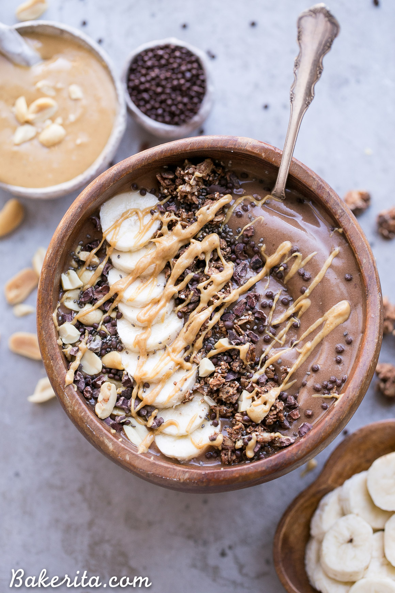

# Chocolate Peanut Butter Smoothie Bowl

**Source:** https://www.bakerita.com/chocolate-peanut-butter-smoothie-bowl/
**Author:** Rachel Conners
**Yield:** ['1', '1 serving']
**Prep time:** PT5M
**Total time:** PT5M
**Category:** ['Breakfast']
**Cuisine:** ['American']
**Rating:** 5 (7 ratings/reviews)

This Chocolate Peanut Butter Banana Smoothie Bowl tastes like a peanut butter cup, but it's actually a filling, superfood-packed breakfast that comes together in just 5 minutes! This gluten-free + vegan smoothie bowl is the perfect easy vegan breakfast.

## Ingredients

- 2 frozen bananas
- ⅓ cup almond milk
- 2 tablespoons peanut butter
- 2 tablespoons cacao powder
- 2 scoops protein powder of your choice
- 2 teaspoons maca powder
- 1 tablespoon chia seeds (flax seeds, or hemp seeds)
- ½ banana (sliced)
- Chocolate granola
- Peanut butter (to drizzle)
- Chia seeds

## Preparation

1. Combine bananas, almond milk, peanut butter, cacao powder, and collagen, maca powder, and chia seeds if using, in a blender (I used my Vitamix). Puree until completely smooth - the mixture should be thick. Add a touch more liquid if necessary to get it to blend completely smooth.
2. Transfer to a bowl and all of your favorite toppings. Serve immediately, and enjoy!

## Nutrition supplied by source

- **Serving Size:** 1 bowl
- **Calories:** 485 kcal
- **Sugar :** 39 g
- **Sodium :** 260 mg
- **Fat :** 19 g
- **Saturated Fat :** 4 g
- **Carbohydrate :** 79 g
- **Fiber :** 12 g
- **Protein :** 13 g

## Tags

['Breakfast']; ['American']; banana; chocolate; gluten free; peanut butter; smoothie; vegan
