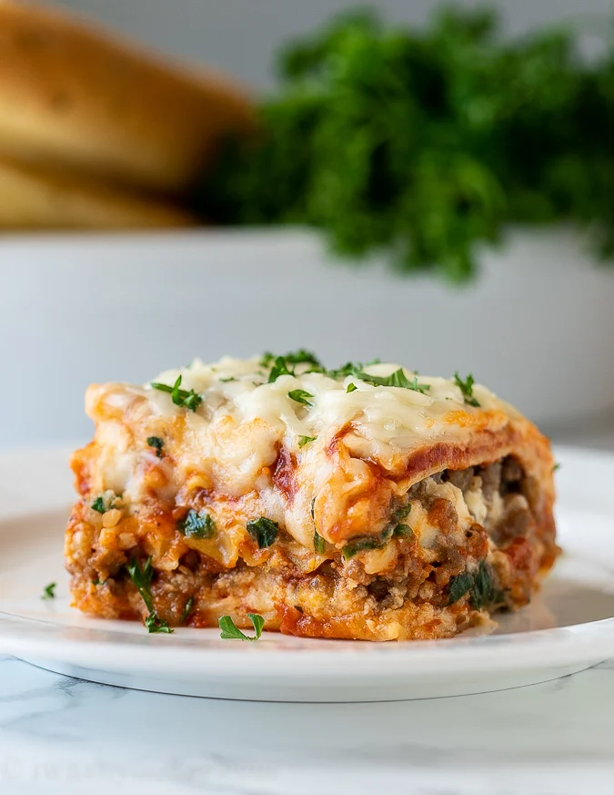

# Classic Lasagna Recipe

**Source:** https://iwashyoudry.com/classic-lasagna-recipe/?utm_source=Pinterest&utm_medium=organic
**Author:** Shawn
**Yield:** ['12']
**Prep time:** PT15M
**Cook time:** PT60M
**Total time:** PT75M
**Category:** ['Dinner']
**Cuisine:** ['Italian']
**Rating:** 4.93 (14 ratings/reviews)

This Classic Lasagna Recipe is so easy and tastes amazing! Filled with Italian sausage, spinach and ricotta cheese, you can't go wrong with this comfort dish!

## Ingredients

- 1 lb. Italian sausage (ground )
- 4 handfuls baby spinach
- 15 oz ricotta cheese
- 2 1/2 cups mozzarella cheese (divided)
- 1/2 cup parmesan cheese
- 1 egg
- 1 tsp Italian Seasoning
- 1 tsp garlic powder
- 1/2 tsp salt
- 1/4 tsp black pepper
- 9 Lasagna noodles (oven ready/no boil )
- 2 1/2 cups marinara sauce

## Preparation

1. Preheat oven to 350 degrees F.
2. Brown sausage in a large skillet, breaking up with a spoon until crumbled and no longer pink. Stir in spinach two handfuls at a time until it all wilts down. Remove from heat and set aside.
3. In a bowl combine the ricotta, 1 cup of mozzarella, parmesan, egg, Italian seasoning, garlic powder, salt and pepper. Stir until combined.
4. Spread 1/2 cup of marinara sauce on the bottom of a 9x13 inch casserole dish. Line 3 lasagna noodles on top of sauce, spread half of the ricotta mixture evenly over the noodles. Top with 1/2 of the sausage mixture. Spread 1 cup of marinara sauce over the sausage and top with 3 more noodles. Spread the remaining ricotta over the noodles, followed by the remaining sausage mixture. Top with the last 3 noodles and then the last cup of the marinara sauce.
5. Cover with foil and bake for 45 minutes. Remove foil and top with the remaining 1 1/2 cups mozzarella cheese then bake 15 minutes uncovered, until cheese is melted and bubbly throughout. Let stand for 10 to 15 minutes before cutting. Enjoy!

## Nutrition supplied by source

- **Calories:** 378 kcal
- **Sugar :** 3 g
- **Sodium :** 898 mg
- **Fat :** 24 g
- **Saturated Fat :** 11 g
- **Carbohydrate :** 21 g
- **Fiber :** 2 g
- **Protein :** 20 g
- **Cholesterol :** 82 mg
- **Serving Size:** 1 serving

## Tags

['Dinner']; ['Italian']; Italian sausage; Lasagna; mozzarella cheese; ricotta cheese
