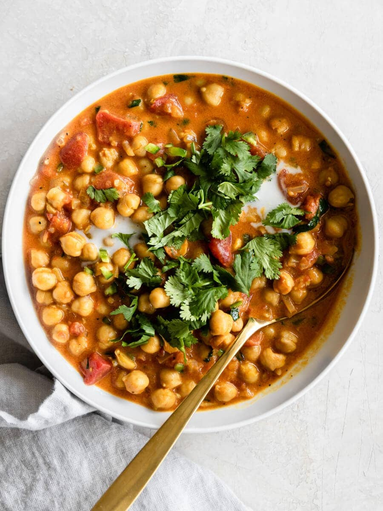

# Coconut Chickpea Curry

**Source:** https://realandvibrant.com/coconut-chickpea-curry/?utm_source=Pinterest&utm_medium=organic
**Yield:** ['6', '6 servings']
**Prep time:** PT5M
**Cook time:** PT25M
**Total time:** PT30M
**Category:** ['Main Dish']
**Cuisine:** ['Indian']
**Rating:** 4.95 (143 ratings/reviews)

The ultimate weeknight dinner, this coconut chickpea curry is packed with flavor and comes together in less than 30 minutes with easy pantry ingredients.

## Ingredients

- 2 tablespoons oil (I use avocado oil)
- ½ medium yellow onion (finely diced)
- 3 cloves garlic (minced)
- ½ inch ginger (minced)
- 1 jalapeño (seeded and finely diced)
- ½ teaspoon ground cumin
- ½ teaspoon ground turmeric
- ½ teaspoon ground paprika
- Pinch of cayenne (optional)
- 1 teaspoon sea salt (to taste)
- ¼ teaspoon black pepper
- 2 (15-oz) cans chickpeas (rinsed and drained)
- 1 (14.5-oz) can diced tomatoes
- 1 can full-fat coconut milk
- 1 lime (juiced)
- ¼ cilantro (optional)

## Preparation

1. Cook onions, garlic, and garlic: In a big pot, warm oil on medium-low heat. Add diced onion, garlic, and ginger. Cook this on medium-low heat, stirring frequently until the onion starts to appear translucent and smell fragrant,, about 5 minutes.
2. Add the spices: Stir in the jalapeño, cumin, turmeric, paprika, cayenne, salt, and pepper, and cook for a minute until it becomes fragrant.
3. Add remaining ingredients: Stir in the chickpeas, diced tomatoes, and coconut milk. Bring to a gentle simmer and cook, uncovered, until the chickpeas are soft and tender, about 20 minutes.
4. Add lime juice and cilantro: Turn off the heat completely and stir in the lime juice and fresh cilantro.
5. Serve and enjoy: If you want to save it for later, be sure to completely cool down the chickpea curry before storing it.

## Nutrition supplied by source

- **Calories:** 312 kcal
- **Carbohydrate :** 25 g
- **Protein :** 9 g
- **Fat :** 21 g
- **Saturated Fat :** 13 g
- **Sodium :** 817 mg
- **Fiber :** 7 g
- **Sugar :** 1 g
- **Serving Size:** 1 serving

## Tags

['Main Dish']; ['Indian']; coconut chickpea curry
