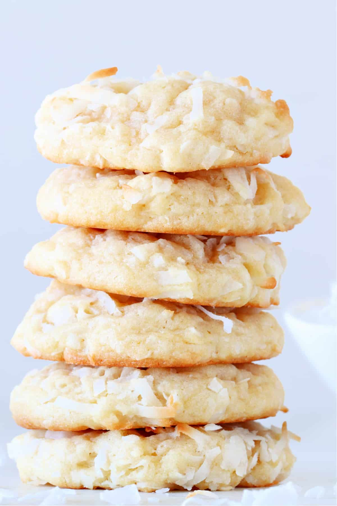

# Coconut Cookies

**Source:** https://www.crunchycreamysweet.com/coconut-cookies/?utm_source=Pinterest&utm_medium=organic
**Yield:** ['12', '12 cookies']
**Prep time:** PT15M
**Cook time:** PT9M
**Total time:** PT54M
**Category:** ['Dessert']
**Cuisine:** ['American']
**Rating:** 4.8 (10 ratings/reviews)

These Coconut Cookies are thick and chewy and packed with sweet coconut! This cookie will be a favorite among coconut fans.

## Ingredients

- 1 ½ cups all-purpose flour
- 1 ½ cups sweetened coconut
- ½ teaspoon baking powder
- ¼ teaspoon baking soda
- ¼ teaspoon salt
- ½ cup unsalted butter
- ½ cup granulated sugar
- ¼ cup packed light brown sugar
- 1 teaspoon vanilla extract
- 1 large egg

## Preparation

1. In a large mixing bowl, whisk together flour, baking soda, baking powder, salt and coconut. Set aside.
2. Place butter in a heat-proof bowl. Microwave for 15 seconds, stir gently, then microwave for 10 more seconds. It should be almost melted. Stir it until smooth and let it cool completely.
3. Add both sugars to butter and whisk or mix with a mixer for 1 minute. It will thicken as you whisk it.
4. Add egg and vanilla and whisk until just incorporated.
5. Add wet ingredients to dry ingredients and stir everything with a wooden spoon.
6. Cover the bowl with dough and chill for 30 minutes in the fridge.
7. Line large baking sheet with parchment paper or silicone baking mat.
8. Preheat oven to 350° F.
9. Scoop 2 tablespoons of dough and roll into a ball. Place on a baking sheet, about 2 inches apart.
10. Bake in preheated oven for 9 minutes.
11. Cool cookies on a rack, then serve.

## Nutrition supplied by source

- **Calories:** 229 kcal
- **Carbohydrate :** 30 g
- **Protein :** 2 g
- **Fat :** 11 g
- **Saturated Fat :** 8 g
- **Trans Fat :** 1 g
- **Cholesterol :** 34 mg
- **Sodium :** 110 mg
- **Fiber :** 1 g
- **Sugar :** 17 g
- **Serving Size:** 1 serving

## Tags

['Dessert']; ['American']; coconut cookies
