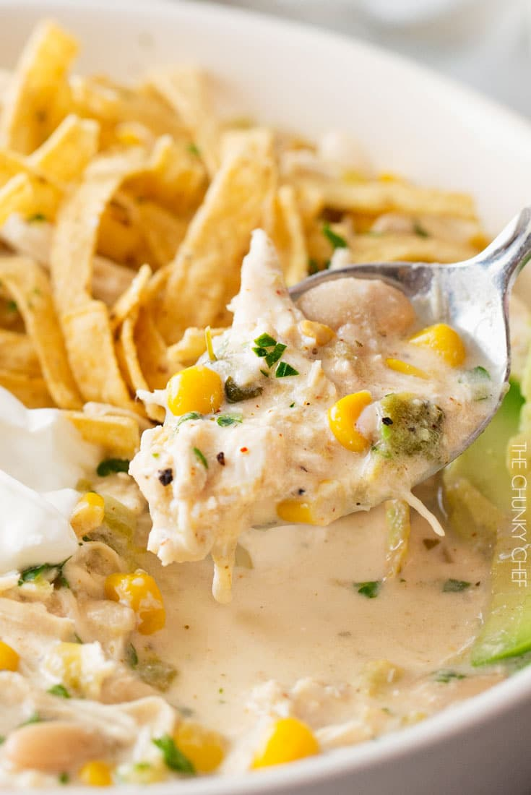

# Creamy Crockpot White Chicken Chili

**Source:** https://www.thechunkychef.com/slow-cooker-creamy-white-chicken-chili/?utm_source=Pinterest&utm_medium=organic
**Yield:** ['6', '6 servings']
**Prep time:** PT5M
**Cook time:** PT480M
**Total time:** PT485M
**Category:** ['Main Course']
**Cuisine:** ['American']
**Rating:** 4.79 (1577 ratings/reviews)

This creamy white chicken chili is made super easy in your crockpot! Creamy with plenty of spice, it's the perfect companion on a chilly night!

## Ingredients

- 1 lb boneless skinless chicken breasts (trimmed of excess fat)
- 1 yellow onion (diced)
- 2 cloves garlic (minced)
- 24 oz. chicken broth ((low sodium))
- 2 15oz cans great Northern beans (drained and rinsed)
- 2 4oz cans diced green chiles ((I do one hot, one mild))
- 1 15oz can whole kernel corn (drained)
- 1 tsp salt
- 1/2 tsp black pepper
- 1 tsp cumin
- 3/4 tsp oregano
- 1/2 tsp chili powder
- 1/4 tsp cayenne pepper
- small handful fresh cilantro (chopped)
- 4 oz reduced fat cream cheese (softened)
- 1/4 cup half and half
- sliced jalapenos
- sliced avocados
- dollop of sour cream
- minced fresh cilantro
- tortilla strips
- shredded Monterey jack or Mexican cheese

## Preparation

1. Add chicken breasts to bottom of slow cooker, top with salt, pepper, cumin, oregano, chili powder, and cayenne pepper.
2. Top with diced onion, minced garlic, great Northern beans, green chiles, corn, chicken broth and cilantro. Stir.
3. Cover and cook on LOW for 8 hours or on HIGH for 3-4 hours.
4. Remove chicken to large mixing bowl, shred, then return to slow cooker.
5. Add cream cheese and half and half, stir, then cover and cook on HIGH for 15 minutes, or until chili is creamy and slightly thickened.
6. If you want to ensure a smooth blend of the cream cheese, try adding the softened cream cheese to a small mixing bowl, then adding a few ladles of the chili from the slow cooker. Whisk until smooth, then stir that mixture into the slow cooker and proceed with adding the half and half and cooking on high for 15 minutes.
7. Stir well and serve with desired toppings.

## Nutrition supplied by source

- **Calories:** 155 kcal
- **Carbohydrate :** 5 g
- **Protein :** 18 g
- **Fat :** 6 g
- **Saturated Fat :** 2 g
- **Cholesterol :** 62 mg
- **Sodium :** 988 mg
- **Sugar :** 1 g
- **Serving Size:** 1 serving

## Tags

['Main Course']; ['American']; chicken chili recipe; chili recipe
