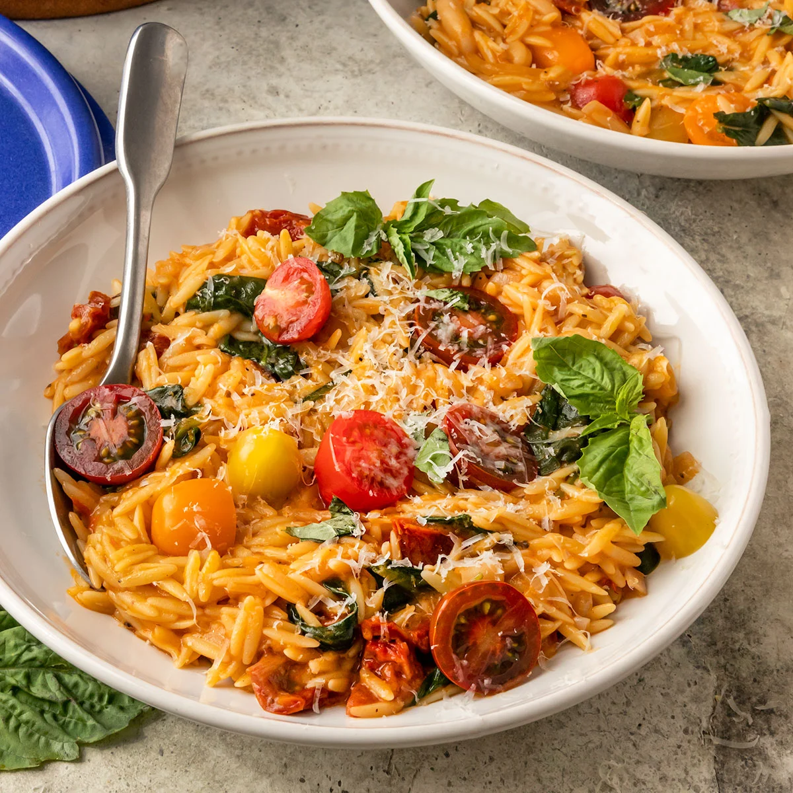

# Creamy Tuscan Orzo

**Source:** https://shortgirltallorder.com/vegan-tuscan-orzo?utm_source=Pinterest&utm_medium=organic
**Yield:** ['6', '6 servings']
**Prep time:** PT10M
**Cook time:** PT30M
**Total time:** PT40M
**Category:** ['Vegetarian Lunch + Dinner']
**Cuisine:** ['Italian']
**Rating:** 4.85 (26 ratings/reviews)

This creamy Tuscan Orzo with spinach, sun-dried tomatoes, cannellini beans, and chewy orzo pasta is the best creamy & cozy weeknight dinner!

## Ingredients

- 2 shallots (thinly sliced)
- 4 cloves garlic (minced)
- 3 Tablespoons vegan butter
- 1 1/2 cups dried orzo pasta
- 1 Tablespoon tomato paste
- 1 teaspoon Italian seasoning
- salt & pepper to taste
- 4 cups vegetable broth (add more if needed)
- 13.5 ounce can full fat coconut milk
- 1 cup cooked cannellini beans
- 1/2 cup sun-dried tomatoes (chopped)
- 3 cups fresh spinach
- 1/2 cup cherry tomatoes (cut in half)
- fresh basil
- vegan parmesan

## Preparation

1. First, prep the veggies by thinly slicing the shallots and mincing the garlic. Set aside.
2. Next, add the vegan butter to the pot and melt over medium heat.
3. Once the butter has melted, add in the shallots and garlic. Cook for 3-5 minutes until the shallots are translucent and the garlic is fragrant.
4. Next, add in the dried orzo, tomato paste, Italian spices, and salt and pepper to your liking. Stir together to toast everything in the pot for about 1 minute.
5. Then, pour in the vegetable broth, canned coconut milk, cannellini beans, and sundried tomatoes.
6. Stir together and cook the orzo uncovered on medium heat for about 15-20 minutes or until the orzo has fully cooked through and is al dente. It is important to continuously stir the orzo while it is cooking so it does not stick to the bottom of the pot.
7. Next, add the fresh spinach and stir it into the cooked orzo. Continue cooking everything together for another 2 minutes. If desired, season with additional salt and pepper at this time.
8. Remove the orzo from the heat and serve immediately with slicing cherry tomatoes, fresh basil, and vegan parmesan. Enjoy!

## Nutrition supplied by source

- **Serving Size:** 1 bowl (without toppings)
- **Calories:** 396 kcal
- **Carbohydrate :** 47 g
- **Protein :** 11 g
- **Fat :** 20 g
- **Saturated Fat :** 13 g
- **Trans Fat :** 1 g
- **Sodium :** 729 mg
- **Fiber :** 5 g
- **Sugar :** 7 g
- **Unsaturated Fat :** 5 g

## Tags

['Vegetarian Lunch + Dinner']; ['Italian']; creamy; creamy orzo pasta; orzo sun dried tomatoes; orzo with spinach; tuscan orzo; vegan orzo; vegan orzo recipe; vegan orzo risotto; vegetarian orzo
