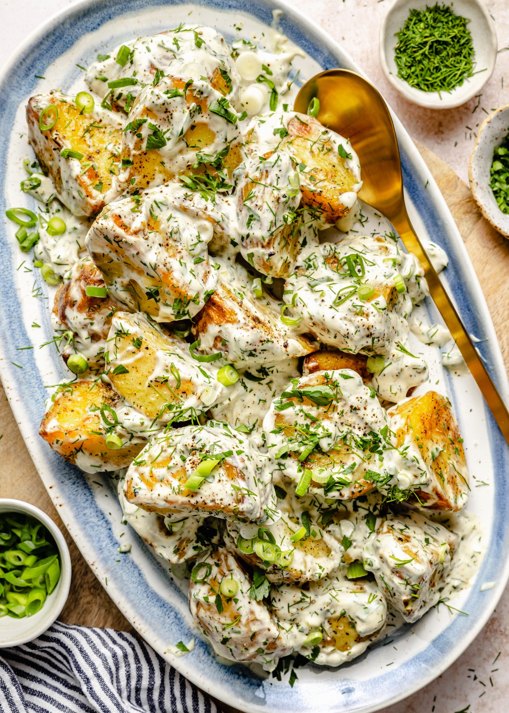

# Crispy Potato Salad

**Source:** https://gimmedelicious.com/crispy-potato-salad/#wprm-recipe-container-30205
**Author:** Layla Atik
**Yield:** ['6', '6 people']
**Prep time:** PT10M
**Cook time:** PT20M
**Total time:** PT30M
**Category:** ['Salad', 'Side Dish']
**Cuisine:** ['American']
**Rating:** 5 (2 ratings/reviews)

This Crispy Potato Salad is creamy, flavorful and the best side dish for your next cookout! It's made with seasoned potatoes that are baked until golden and crisp on the outside. Then, they're tossed in a simple dressing and garnished with herbs. So easy and so delicious!

## Ingredients

- 3 lbs Yukon gold potatoes (cut into 2-inch pieces)
- 3 tablespoons olive oil
- 1/2 teaspoon garlic powder
- 1/2 cup sour cream
- 1/2 cup mayonnaise
- 1/4 cup finely chopped fresh scallions (divided)
- 2 tablespoons finely chopped fresh dill (divided)
- 2 tablespoons finely chopped fresh parsley (divided)
- 1 tablespoon Dijon mustard
- 1 tablespoon lemon juice
- Kosher salt and freshly cracked black pepper (to taste)

## Preparation

1. In a large stock pot filled with cold water, add cubed potatoes with 1 tablespoon salt and bring to a boil over high heat. Once boiling, reduce heat to medium-high, cooking potatoes until tender and can be pierced with a fork, about 12 to 16 minutes. Drain.
2. Preheat oven to 400°F and line a baking sheet with aluminum foil, set aside. In a bowl combine potatoes with olive oil, garlic powder, salt, and pepper, gently tossing to combine.
3. Spread potatoes in an even layer onto the prepared baking sheet and bake until the potatoes are very brown and crispy about 30 minutes.
4. While the potatoes are roasting, make the dressing. In a large bowl, combine sour cream, and mayonnaise.
5. Reserve 1 tablespoon of scallions and add the remaining scallions to the bowl alongside 1 tablespoon dill, 1 tablespoon parsley, dijon mustard, and lemon juice. Stir to combine, seasoning with salt and pepper to taste.
6. Wait until right before serving to toss the potatoes in the dressing.
7. Transfer to a serving dish, topping with reserved scallions, dill, and parsley.

## Nutrition supplied by source

- **Serving Size:** 1 serving
- **Calories:** 329 kcal
- **Carbohydrate :** 41 g
- **Protein :** 5 g
- **Fat :** 17 g
- **Saturated Fat :** 4 g
- **Trans Fat :** 0.01 g
- **Cholesterol :** 14 mg
- **Sodium :** 96 mg
- **Fiber :** 5 g
- **Sugar :** 3 g
- **Unsaturated Fat :** 11 g

## Tags

['Salad', 'Side Dish']; ['American']; creamy; pototo salad
