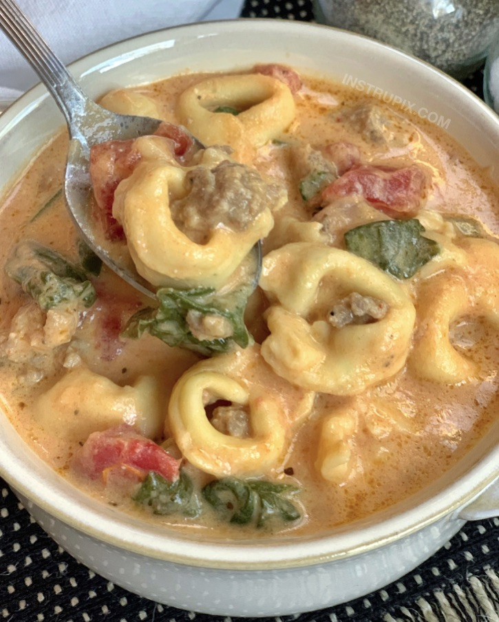

# Crockpot Tortellini & Sausage Soup (Creamy & Delish!)

**Source:** https://www.instrupix.com/slow-cooker-creamy-sausage-tortellini-soup/?utm_source=Pinterest&utm_medium=organic
**Yield:** ['6']

If you're looking for easy slow cooker soup recipes, your search ends here. This cheap and simple recipe is a real family pleaser! Even the kids love it. It's made with just 6 simple ingredients: frozen tortellini, sausage, cream cheese, tomatoes, broth and spinach.

## Ingredients

- 1 lb Italian sausage ((browned & drained))
- 2 (15oz) cans Italian diced tomatoes
- 4 cups vegetable or chicken broth ((32oz container))
- 8 ounces cream cheese ((cubed))
- 1 (20oz) bag of frozen cheese tortellini
- 3-4 cups fresh spinach

## Preparation

1. Add the browned, chopped and drained sausage, chicken broth, both cans of diced tomatoes, and cubed cream cheese to your slow cooker. Give it a good stir and cook on LOW for about 4 hours or until the cream cheese has completely dissolved.
2. Stir in the spinach and frozen tortellini and cook for an additional 30 minutes or until the pasta is done to your liking.
3. Serve immediately and store any leftovers in the fridge for up to 3 days.

## Tags

[Add personal tags]
