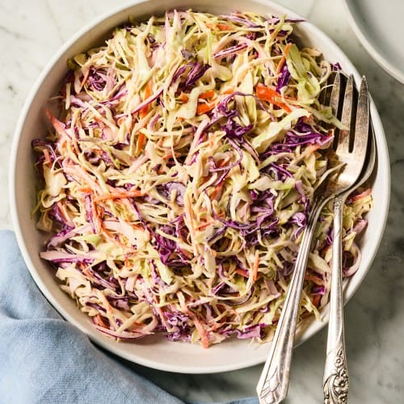

# Easy Creamy Coleslaw Recipe

**Source:** https://www.loveandlemons.com/coleslaw-recipe/?utm_source=Pinterest&utm_medium=organic
**Author:** Jeanine Donofrio, Phoebe Moore
**Yield:** ['6']
**Prep time:** PT30M
**Total time:** PT30M
**Category:** ['Salad', 'Side Dish']
**Cuisine:** ['American']
**Rating:** 4.94 (131 ratings/reviews)

This easy coleslaw recipe is the perfect summer side dish! The creamy homemade dressing fills it with sweet and tangy flavor. I like to shred the cabbage and carrots myself, but feel free to use a store-bought bag of slaw mix if you prefer.

## Ingredients

- ¾ cup mayonnaise (slightly scant)
- 2 tablespoons apple cider vinegar
- 1 tablespoon Dijon mustard
- 1 tablespoon sugar
- ¾ teaspoon celery seeds
- ¼ teaspoon sea salt
- Freshly ground black pepper
- 6 cups shredded green cabbage
- 2 cups shredded red cabbage
- 2 medium carrots (julienned or shredded on the large holes of a box grater)
- 1 cup thinly sliced red onion

## Preparation

1. Make the coleslaw dressing. In a medium bowl, whisk together the mayonnaise, apple cider vinegar, mustard, sugar, celery seeds, salt, and several grinds of pepper.
2. Make the coleslaw. In a large bowl, toss together the green and red cabbage, carrots, and onion. Pour the dressing over the top and toss to coat. Season to taste with salt and pepper.
3. Chill in the refrigerator for at least 1 hour before serving to allow the cabbage to soften and the flavors to meld.

## Nutrition supplied by source

- **Calories:** 247 kcal
- **Carbohydrate :** 13 g
- **Protein :** 2 g
- **Fat :** 21 g
- **Saturated Fat :** 3 g
- **Trans Fat :** 0.1 g
- **Cholesterol :** 12 mg
- **Sodium :** 339 mg
- **Fiber :** 4 g
- **Sugar :** 8 g
- **Unsaturated Fat :** 18 g
- **Serving Size:** 1 serving

## Tags

['Salad', 'Side Dish']; ['American']; Coleslaw; Coleslaw recipe
