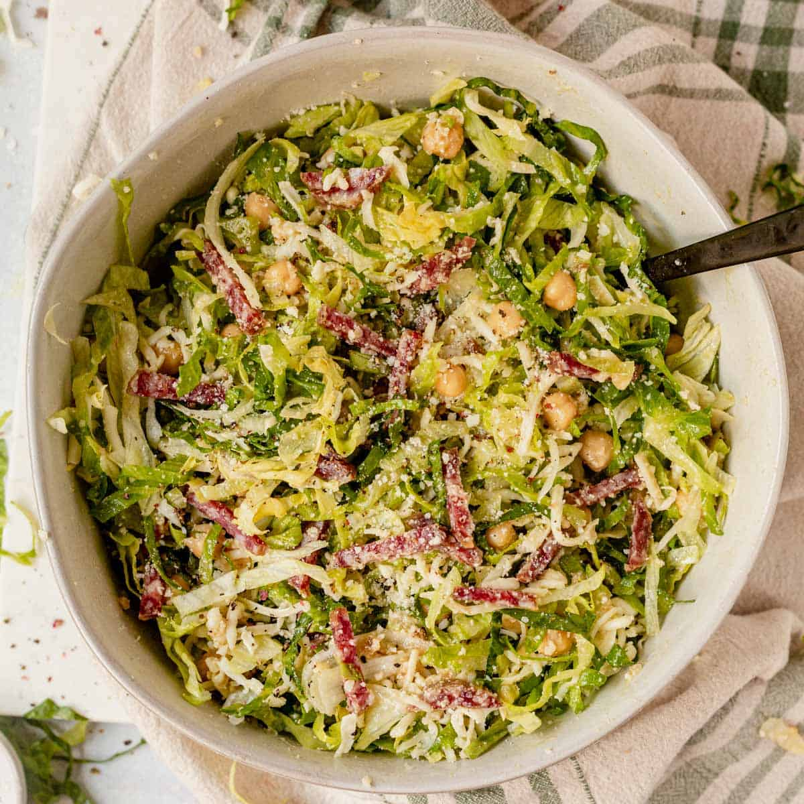

# Famous La Scala Chopped Salad Recipe

**Source:** https://whatmollymade.com/la-scala-chopped-salad/?utm_source=Pinterest&utm_medium=organic#wprm-recipe-container-44272
**Yield:** ['6', '6 servings']
**Prep time:** PT20M
**Total time:** PT20M
**Category:** ['Dinner', 'Healthy', 'Salad', 'Side Dish']
**Cuisine:** ['American', 'Italian']
**Rating:** 4.89 (61 ratings/reviews)

This famous La Scala Chopped Salad is so easy to make at home! Toss the dressing and all of the ingredients together and enjoy on its own as a main dish or healthy lunch, or serve it on the side with your favorite protein.

## Ingredients

- ⅓ cup extra virgin olive oil
- 3 Tablespoons red wine vinegar
- 2 cloves garlic minced
- 3 teaspoons Dijon mustard (or 1 teaspoon dry mustard)
- ½ teaspoon kosher salt and pepper
- ⅓ cup grated Pecorino Romano cheese (or grated parmesan cheese)
- 1 head shredded iceberg lettuce ((5-6 cups) )
- 1 head shredded romaine lettuce ((4-5 cups) )
- 1 (15-ounce) can chickpeas (drained and rinsed)
- ¼ lb ((4 ounces) Italian salami (thinly sliced)
- 2 cups shredded mozzarella cheese

## Preparation

1. Add all of the salad dressing ingredients to a small bowl or small jar. Whisk everything together or close the lid and shake to combine.
2. To a large bowl, add the shredded lettuce, chickpeas, Italian salami, and mozzarella cheese. Pour the prepared dressing on top and toss to coat.
3. Enjoy this la scala salad recipe right away. Store leftovers in the fridge for 1-2 days. Store the dressing separately to prep in advance.

## Nutrition supplied by source

- **Serving Size:** 1 serving
- **Calories:** 371 kcal
- **Carbohydrate :** 13.8 g
- **Protein :** 24.7 g
- **Fat :** 24.7 g
- **Cholesterol :** 36.5 mg
- **Sodium :** 1216 mg
- **Fiber :** 4.6 g
- **Sugar :** 1.6 g

## Tags

['Dinner', 'Healthy', 'Salad', 'Side Dish']; ['American', 'Italian']; easy salad; italian salad; low carb
