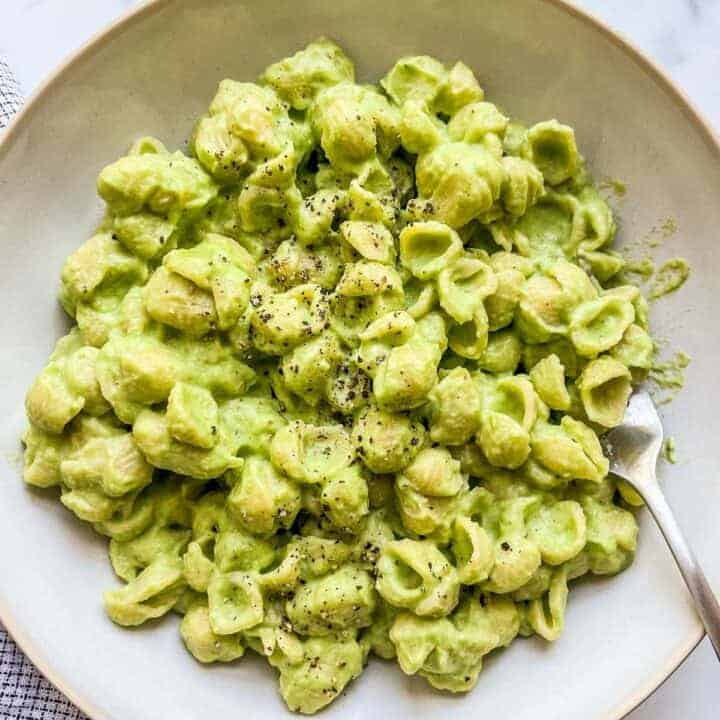

# Green Mac and Cheese

**Source:** https://thishealthytable.com/blog/green-mac-and-cheese/
**Author:** This Healthy Table
**Yield:** 6
**Prep time:** PT10M
**Cook time:** PT10M
**Total time:** PT20M
**Category:** Main Meal Recipes
**Cuisine:** American
**Rating:** 5 (8 ratings/reviews)

This fantastic and fun green mac and cheese will be a hit with the whole family! It's a great way to sneak some veggies into a pasta dish.

## Ingredients

- 1 head of cauliflower (or 4 cups frozen cauliflower)
- 1 pound pasta (small shape of your choice)
- 2 cups baby spinach
- 1 cup of milk (whole milk, skim milk, or oat milk)
- 1 1/2 cups shredded cheddar cheese
- 1 teaspoon kosher salt
- 1/4 teaspoon ground black pepper

## Preparation

1. Cut the cauliflower into large pieces and place in a large pot with enough water to cover the cauliflower. Cover and bring to a boil over high heat. Reduce the heat and simmer for 5 to 8 minutes or until the cauliflower is fork tender.
2. Meanwhile, cook the pasta according to package directions. Before straining, retain a cup of pasta water in case the sauce is too thick.
3. Add the cooked cauliflower, baby spinach, milk, cheese, salt, and optional pepper to a blender or food processor. Blend for 1 to 2 minutes until the sauce is creamy and smooth. Add 1/4 cup of pasta water at a time to loosen the sauce if it is too thick.
4. Combine either the full amount of sauce with the pasta if you want a saucy pasta or half the sauce with the pasta (put the remaining sauce in the fridge or freezer) if you want a boxed mac and cheese like consistency.
5. Top with additional salt or pepper if desired.

## Nutrition supplied by source

- **Calories:** 278 calories
- **Carbohydrate :** 30 grams carbohydrates
- **Cholesterol :** 31 milligrams cholesterol
- **Fat :** 11 grams fat
- **Fiber :** 4 grams fiber
- **Protein :** 14 grams protein
- **Saturated Fat :** 6 grams saturated fat
- **Serving Size:** 1
- **Sodium :** 436 milligrams sodium
- **Sugar :** 5 grams sugar
- **Trans Fat :** 0 grams trans fat
- **Unsaturated Fat :** 4 grams unsaturated fat

## Tags

Main Meal Recipes; American; green mac and cheese; spinach cauliflower mac and cheese; green pasta; spinach mac and cheese
