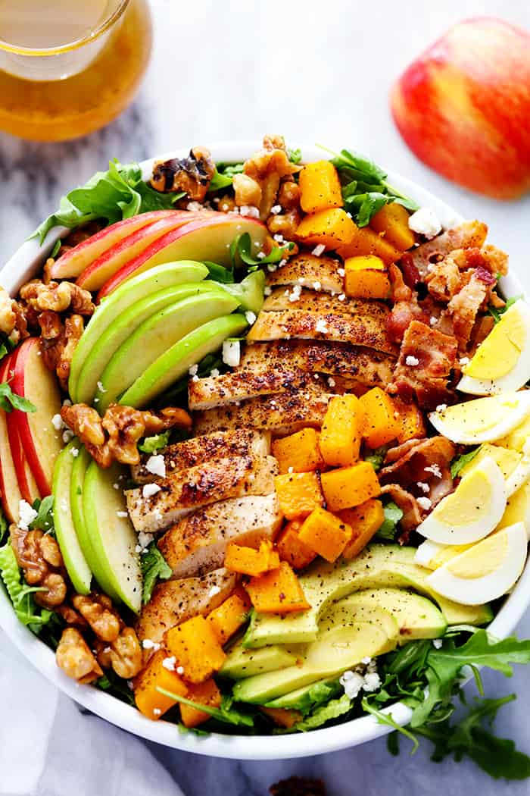

# Harvest Cobb Salad with a Honey Apple Cider Vinaigrette

**Source:** https://therecipecritic.com/harvest-cobb-chicken-salad-honey-apple-cider-vinaigrette/?utm_source=Pinterest&utm_medium=organic
**Yield:** ['8', '8 servings']
**Prep time:** PT20M
**Total time:** PT20M
**Category:** ['Dinner', 'Main Course', 'Salad', 'Side Dish']
**Cuisine:** ['American']

Harvest Cobb Chicken Salad with a Honey Apple Cider Vinaigrette is filled with crisp fall apples, roasted butternut squash, and all of the delicious things of fall come together in this mouthwatering salad.

## Ingredients

- 5 cups chopped romaine lettuce
- 1 cup arugula
- 2 cups cooked and chopped boneless skinless chicken breast
- 5 slices cooked and chopped bacon
- 2 hard-boiled eggs, (peeled and sliced)
- 2 sliced apples, (Granny Smith or honey crisp)
- 1 cup roasted and cubed butternut squash
- 1 sliced avocado
- ½ cup prepared candied walnuts, (recipe follows)
- ¼ cup crumbled feta cheese
- ¾ cup olive oil
- ¾ cup apple cider vinegar
- 2 tablespoons water
- ¼ cup honey
- 1 teaspoon salt
- ¼ teaspoon pepper

## Preparation

### Salad

1. In a large bowl add 5 cups chopped romaine lettuce and 1 cup arugula. Add 2 cups cooked and chopped boneless skinless chicken breast, 5 slices cooked and chopped bacon, 2 hard-boiled eggs, 2 sliced apples, 1 cup roasted and cubed butternut squash, and 1 sliced avocado. Toss gently to mix the ingredients.
2. Top the salad with ½ cup prepared candied walnuts, and ¼ cup crumbled feta cheese.
### Dressing

3. In a small bowl whisk ¾ cup olive oil, ¾ cup apple cider vinegar, 2 tablespoons water, ¼ cup honey, 1 teaspoon salt, and ¼ teaspoon pepper.
4. Drizzle the dressing over the salad and enjoy!

## Nutrition supplied by source

- **Calories:** 462 kcal
- **Carbohydrate :** 24 g
- **Protein :** 14 g
- **Fat :** 35 g
- **Saturated Fat :** 6 g
- **Trans Fat :** 0.02 g
- **Cholesterol :** 84 mg
- **Sodium :** 534 mg
- **Fiber :** 4 g
- **Sugar :** 17 g
- **Unsaturated Fat :** 25 g
- **Serving Size:** 1 serving

## Tags

['Dinner', 'Main Course', 'Salad', 'Side Dish']; ['American']; harvest cobb salad; honey apple cider vinaigrette
