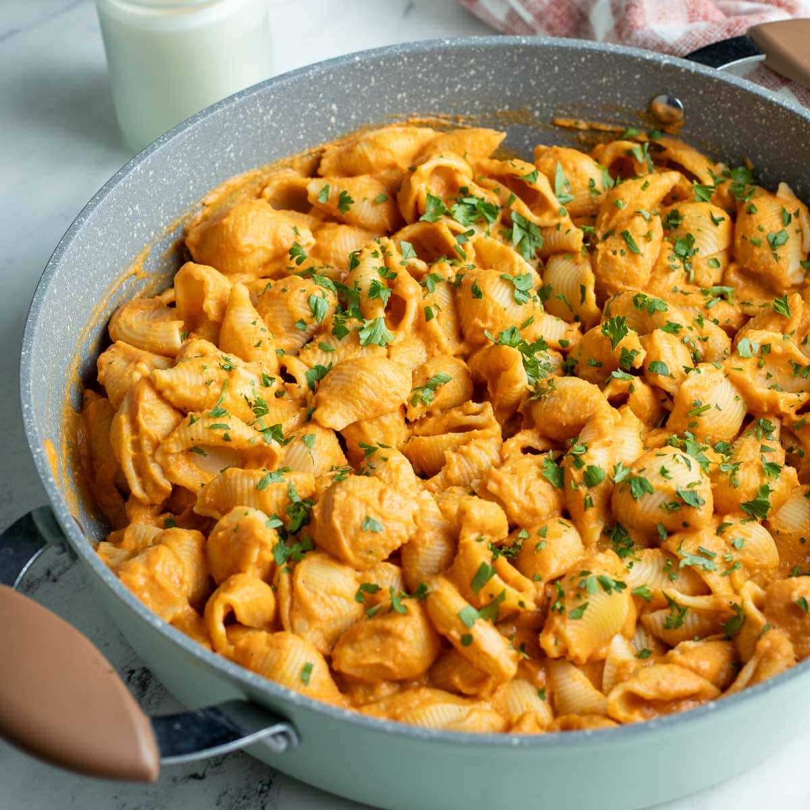

# Hidden Veggie Pasta Sauce

**Source:** https://www.keepingthepeas.com/hidden-veggie-pasta-sauce/?utm_source=Pinterest&utm_medium=organic
**Yield:** ['8']
**Prep time:** PT15M
**Cook time:** PT40M
**Total time:** PT55M
**Category:** ['Main Course', 'Pasta']
**Cuisine:** ['American']

This hidden veggie pasta sauce is loaded with flavor, a rich texture, and many vegetables. Roasted veggies are blended with broth, soy milk, nutritional yeast, and seasonings to create a rich, creamy sauce full of health benefits as flavor.

## Ingredients

- 2 cups butternut squash (cubed)
- 1 red bell pepper
- 2 cups cauliflower florets
- 2 carrots (peeled and nut into large chunks)
- 1 yellow onion (cut into quarters)
- 3 cloves garlic
- 2 tbsp extra virgin olive oil
- 2 tsp smoked paprika
- 1 tsp garlic powder
- 1 tsp onion powder
- 1 tsp fine sea salt
- 1/2 tsp ground black pepper
- 1/4 cup nutritional yeast
- 1 cup unsweetened soy milk (or other unsweetened plant milk)
- 1 cup low sodium vegetable broth
- 1/2 cup reserved pasta water
- 12 ounces pasta shells

## Preparation

1. Preheat your oven to 400°F. Line a large baking sheet with parchment paper.
2. Add the butternut squash, red pepper, cauliflower, carrots, onion, and garlic to the baking sheet. Sprinkle with the smoked paprika, garlic powder, onion, powder, salt, and pepper. Drizzle with olive oil, and toss it all together with your hands to combine.
3. Roast in the oven for 40 minutes until all the vegetables are golden brown and can easily be pierced with a fork. Toss the vegetables halfway through cooking time.
4. While the vegetables are roasting prepare your pasta of choice. Cook according to package directions for al dente. Reserve half a cup of the pasta water before draining.
5. Add the roasted vegetables to a large high-speed blender. Add the vegetable broth, soy milk, nutritional yeast, and reserved pasta water. Blend until smooth.
6. Pour the sauce over the prepared pasta. Sprinkle with cashew parm, and enjoy!

## Nutrition supplied by source

- **Calories:** 242 kcal
- **Carbohydrate :** 42 g
- **Protein :** 9 g
- **Fat :** 7.7 g
- **Saturated Fat :** 1.1 g
- **Sodium :** 154 mg
- **Fiber :** 12.2 g
- **Sugar :** 8.1 g
- **Serving Size:** 1 serving

## Tags

['Main Course', 'Pasta']; ['American']; hidden veggie pasta sauce
