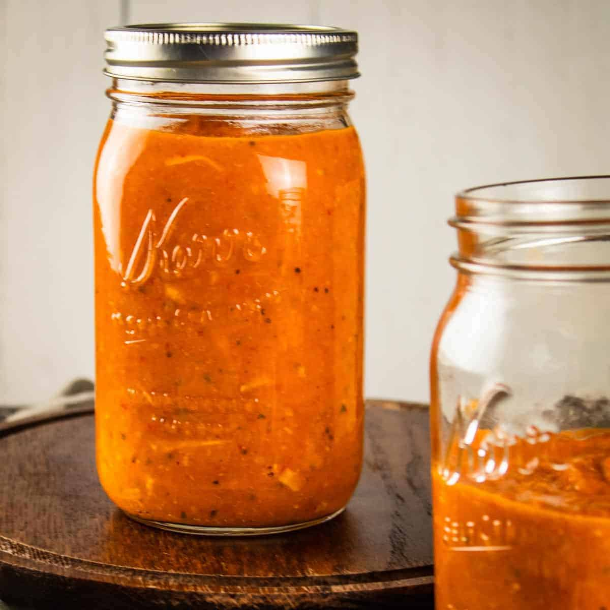

# Hidden Veggie Pasta Sauce

**Source:** https://scarlatifamilykitchen.com/hidden-vegetable-pasta-sauce/?utm_source=Pinterest&utm_medium=organic
**Yield:** ['32', '32 servings']
**Prep time:** PT15M
**Cook time:** PT40M
**Total time:** PT55M
**Category:** ['Dinner', 'Lunch']
**Cuisine:** ['Italian']
**Rating:** 5 (4 ratings/reviews)

This simple hidden veggie pasta sauce is packed full of flavor. Loaded with your favorite fresh garden vegetables, this light and easy sauce is perfect for pasta!

## Ingredients

- 1 medium red bell pepper
- 1 medium orange bell pepper
- 1 medium zucchini
- 1 medium yellow summer squash
- 3 medium tomatoes
- ¼ cup olive oil
- ½ teaspoons kosher salt
- ¼ teaspoon black pepper
- 28 ounces canned tomato sauce
- 1 teaspoon garlic powder
- ½ cup grated pecorino romano cheese

## Preparation

1. Roughly chop all of the vegetables and set aside.
2. Heat a large skillet or pan on the stove top over medium heat with the olive oil.
3. Add in all of the chopped fresh vegetables and cook for 10-15 minutes until the vegetables are slightly softened.
4. Reduce the heat to medium low and stir in the tomato sauce. Allow the sauce to simmer for 20-25 minutes or until the vegetables are completely softened and easily mashed.
5. Puree the sauce in a blender, working in batches if needed, to the desired consistency.
6. Add the blended sauce back to the pan and mix in the garlic powder and cheese.
7. Use the sauce immediately or cool and store for later use.

## Nutrition supplied by source

- **Serving Size:** 0.5 cup
- **Calories:** 34 kcal
- **Sugar :** 2 g
- **Sodium :** 187 mg
- **Fat :** 2 g
- **Saturated Fat :** 1 g
- **Carbohydrate :** 3 g
- **Fiber :** 1 g
- **Protein :** 1 g
- **Cholesterol :** 2 mg
- **Unsaturated Fat :** 2 g

## Tags

['Dinner', 'Lunch']; ['Italian']; blended veggie pasta sauce; hidden veggie pasta sauce; veggie pasta sauce
