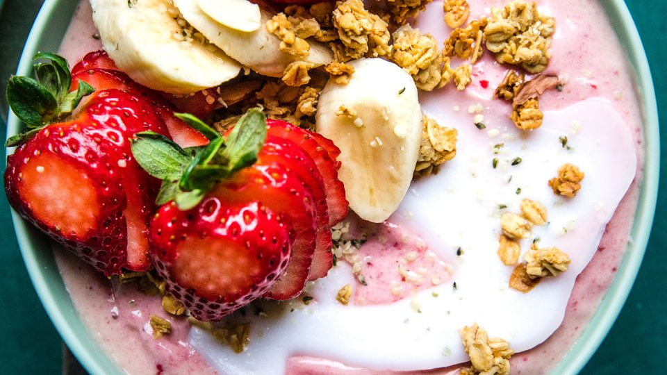

# How to Make a Smoothie Bowl

**Source:** https://themodernproper.com/how-to-make-a-smoothie-bowl
**Author:** Holly Erickson, Natalie Mortimer
**Yield:** 1
**Prep time:** PT10M
**Total time:** PT10M
**Category:** ['breakfast', 'brunch', 'lunch', 'dairy-free', 'gluten-free', 'vegan', 'vegetarian', '30-minute-meals', 'kid-friendly']
**Cuisine:** American
**Rating:** 5 (5 ratings/reviews)

Breakfast, lunch or dessert—this smoothie bowl recipe is a treat any which way you enjoy it! And we’re sharing our ultimate smoothie bowl topping trick, too!

## Ingredients

- 1 cup frozen strawberries or mixed frozen berries
- 1 cup frozen banana slices,, from very ripe bananas (see Note)
- 3 tablespoons milk or nondairy milk, such as almond milk
- 2 tablespoons almond butter, sunflower seed butter, or peanut butter (optional)
- 2 tablespoons vanilla or unflavored protein powder, (optional)
- 1 tablespoon coconut oil, melted
- ¼ cup granola
- 1 tablespoon hemp seeds
- Fresh strawberries, sliced
- Fresh bananas, sliced

## Preparation

1. Add the frozen berries and bananas to a blender and blend on LOW until coarse and sandy in texture.
2. Add the milk, nut butter, and protein powder (if using) and blend on LOW, scraping down the sides as needed, until the mixture comes together in a thick “soft serve” consistency.
3. Scoop the smoothie into a bowl and drizzle with the melted coconut oil. Allow the coconut oil to harden for 1 minute (you can place it in the freezer to speed up this process). Sprinkle with granola and hemp seeds and garnish with fresh fruit.

## Nutrition supplied by source

- **Calories:** 434 calories
- **Carbohydrate :** 54 grams carbohydrates
- **Cholesterol :** 0 milligrams cholesterol
- **Fat :** 20 grams fat
- **Fiber :** 10 grams fiber
- **Protein :** 21 grams protein
- **Saturated Fat :** 3 grams saturated fat
- **Serving Size:** 1
- **Sodium :** 108 milligrams sodium
- **Sugar :** 29 grams sugar

## Tags

['breakfast', 'brunch', 'lunch', 'dairy-free', 'gluten-free', 'vegan', 'vegetarian', '30-minute-meals', 'kid-friendly']; American; how to make a smoothie bowl; spring recipe; summer recipe; fall recipe; winter recipe; dairy-free recipe; gluten-free recipe; vegan recipe; vegetarian recipe; 30-minute-meals; kid-friendly
