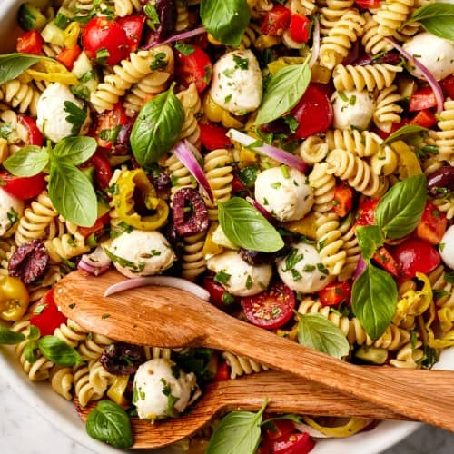

# Italian Pasta Salad

**Source:** https://www.loveandlemons.com/italian-pasta-salad/?utm_source=Pinterest&utm_medium=organic
**Author:** Jeanine Donofrio, Phoebe Moore
**Yield:** ['8', '8 to 12']
**Category:** lunch, pasta, salads, side dishes, vegetarian
**Rating:** 4.98 (34 ratings/reviews)

This pasta salad with Italian dressing, colorful veggies, olives, cheese, and pepperoncini is fresh, zesty, and delicious. It's a perfect side dish to make ahead for summer picnics and cookouts.

## Ingredients

- 1 pound fusilli or rotini pasta
- Extra-virgin olive oil (for drizzling)
- 2 cups cherry tomatoes (halved)
- 1½ cups mini fresh mozzarella cheese balls (8 ounces)
- 1 medium red bell pepper (stemmed, seeded, and diced)
- ½ English cucumber (diced)
- 1 cup thinly sliced red onion
- ¾ cup kalamata olives (pitted and halved)
- ¾ cup sliced pepperoncini
- ½ cup chopped fresh parsley
- 1 recipe Italian Dressing
- 1½ teaspoons sea salt
- Freshly ground black pepper
- 1 cup fresh basil leaves (plus more for garnish)

## Preparation

1. Bring a large pot of salted water to a boil. Prepare the pasta according to the package instructions, cooking until slightly past al dente. Drain and toss with a drizzle of olive oil to prevent sticking. Set aside to cool to room temperature.
2. Transfer the cooled pasta to a large bowl and add the cherry tomatoes, mozzarella, red pepper, cucumber, red onion, olives, pepperoncini, and parsley. Toss to combine, then add the dressing, salt, and several grinds of pepper and toss again.
3. Stir in the basil and season to taste. Garnish with more basil and serve.

## Tags

lunch, pasta, salads, side dishes, vegetarian; italian pasta salad; summer
