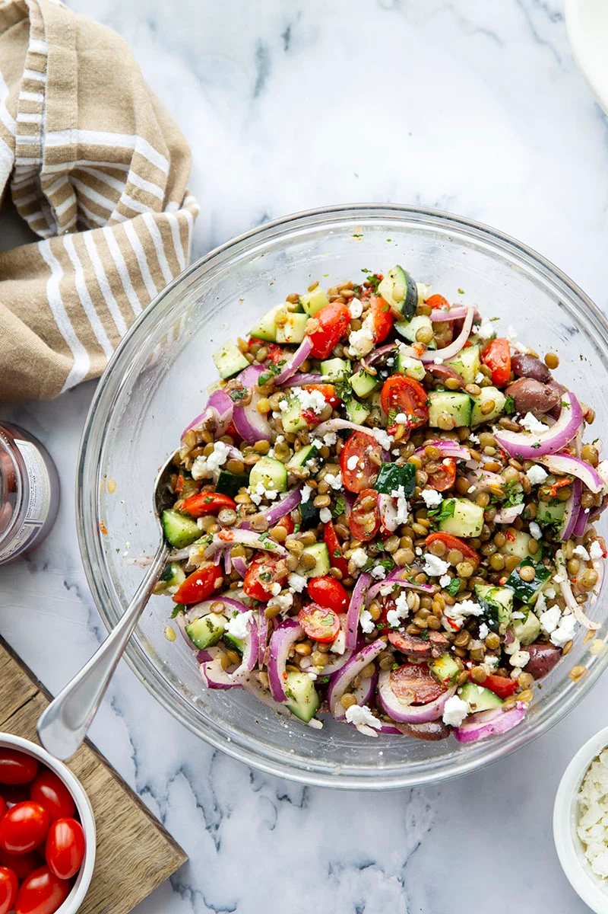

# Mediterranean Lentil Salad

**Source:** https://wholeandheavenlyoven.com/2023/01/12/mediterranean-lentil-salad/?utm_source=Pinterest&utm_medium=organic
**Yield:** ['6', '6 servings']
**Prep time:** PT30M
**Cook time:** PT25M
**Total time:** PT55M
**Rating:** 4.38 (8 ratings/reviews)

Packed with fresh Mediterranean ingredients, tender lentils, and a flavorful citrus dressing, this Mediterranean lentil salad is quick to throw together and sure to be a lunch favorite!

## Ingredients

- 1 cup dry lentils ((green, brown, or black all work - see blog post for more details))
- 4 cups water
- 1 bay leaf
- 1 medium cucumber, cut into 1/4-in cubes
- 1/2 small red onion, thinly sliced
- 1-1/2 cups cherry tomatoes, halved
- 1/2 cup kalamata olives, halved
- 1/2 cup diced roasted red peppers
- 1/2 cup crumbled feta cheese
- 2 teaspoons dried oregano
- 2 tablespoons fresh mint, minced
- 2 tablespoons freshly-squeezed orange juice
- 2 tablespoons freshly-squeezed lemon juice
- 1 tablespoon Dijon mustard
- 1 tablespoon honey or agave nectar
- 1/4 cup extra-virgin olive oil
- Salt and pepper to taste

## Preparation

1. Place lentils in a fine-mesh sieve and rinse well under cold water, removing any imperfect or bad lentils.
2. Place lentils, water, and bay leaf in a medium pot. Bring to a boil over high heat, then reduce heat to medium-low, cover, and allow to cook 18-25 minutes until lentils are tender, but not mushy.
3. Drain lentils, discard bay leaf, and allow lentils to cool in a large bowl in fridge.
4. Once lentils are cooled, add cucumber, red onion, cherry tomatoes, olives, roasted red peppers, feta, oregano, and mint to bowl and toss well until combined. Set aside for a moment.
### Citrus Dressing

5. In a small bowl, whisk orange juice, lemon juice, Dijon, and honey until smooth. Slowly begin drizzling in olive oil until dressing is smooth. Season dressing with salt and pepper to taste.
6. Drizzle dressing over salad and toss until evenly coated. Season with additional salt and pepper to taste if needed. Store salad in refrigerator until ready to serve. Enjoy!

## Nutrition supplied by source

- **Serving Size:** 8 oz
- **Calories:** 271 kcal
- **Carbohydrate :** 29.6 g
- **Protein :** 11.3 g
- **Fat :** 13 g
- **Saturated Fat :** 3.4 g
- **Cholesterol :** 11 mg
- **Sodium :** 310 mg
- **Fiber :** 11.6 g
- **Sugar :** 7.4 g

## Tags

[Add personal tags]
