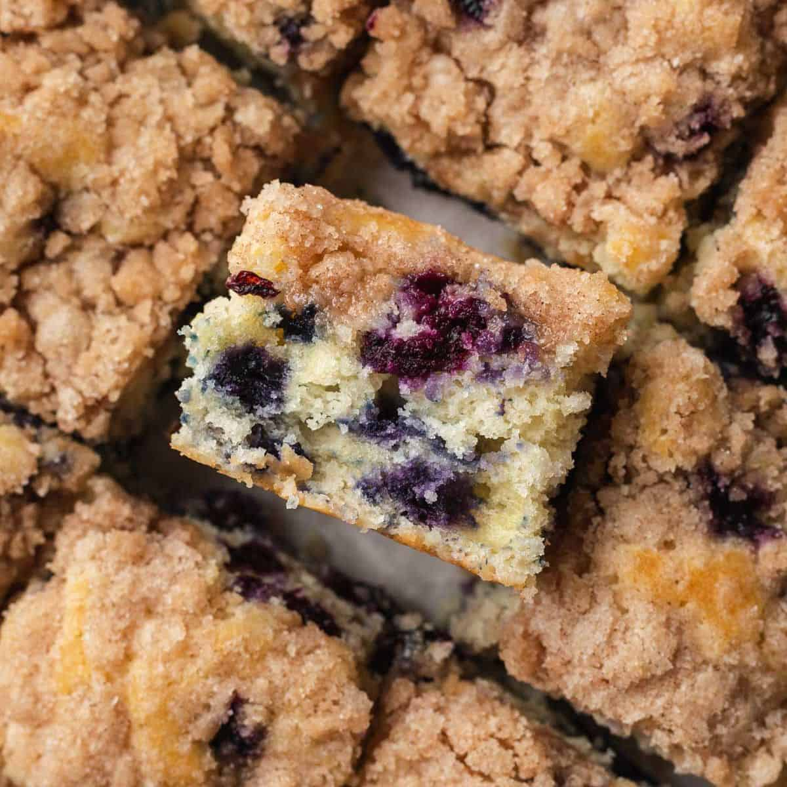

# Moist Blueberry Buckle Cake with Cinnamon Streusel Topping

**Source:** https://www.bakeandbacon.com/blueberry-buckle-cake/?utm_source=Pinterest&utm_medium=organic
**Yield:** ['12', '12 servings']
**Prep time:** PT15M
**Cook time:** PT35M
**Total time:** PT50M
**Category:** ['Breakfast', 'Brunch', 'Dessert']
**Cuisine:** ['American']
**Rating:** 4.96 (87 ratings/reviews)

This Blueberry Buckle Cake gives you a tender, moist cake bursting with fresh blueberries and topped with the best crumbly, buttery streusel topping. It's perfect for breakfast, brunch, or dessert! Made with simple ingredients & in less than an hour, this cake is perfect to bring to your next gathering with family and friends.

## Ingredients

- 2 cups all-purpose flour (spooned and leveled)
- 2 tsp baking powder
- ½ tsp salt
- ¼ cup unsalted butter (at room temperature)
- ¾ cup granulated sugar
- 1 large egg (at room temperature)
- 1 tsp vanilla extract
- ½ cup whole milk (at room temperature)
- 2 cups blueberries (+ 1 tbsp flour for tossing)
- ½ cup granulated sugar
- ⅓ cup all-purpose flour (spooned and leveled)
- ½ tsp cinnamon

## Preparation

### Blueberry Cake:

1. Preheat the oven to 375° F. Line a 9x9 baking dish with parchment paper and set aside.
2. In a medium bowl whisk together the flour, baking powder, and salt. Set aside.
3. In a separate large bowl using an electric mixer or stand mixer with a paddle attachment, cream sugar and butter together until smooth, about 1-2 minutes. Add the egg and vanilla, mixing until just combined. Use a rubber spatula to scrape down the sides of the bowl as needed.
4. Add the flour mixture and milk in alternating additions, starting and ending with the flour mixture. Mix until just combined- be careful not to over mix here.
5. Coat the blueberries with 1 tbsp flour and gently fold them into the batter. Spread the batter into the prepared baking pan (it will be thick).
### Streusel Topping:

6. In a bowl, cut the butter and other ingredients together with a fork or pastry cutter until it becomes crumbly. Sprinkle evenly on top of the cake.
7. Bake the cake at 375° for 30-35 minutes or until a toothpick comes out clean. Allow the cake to cool in the pan for about 10 minutes, and then remove it to a wire cooling rack.

## Nutrition supplied by source

- **Calories:** 262 kcal
- **Carbohydrate :** 44 g
- **Protein :** 4 g
- **Fat :** 9 g
- **Saturated Fat :** 5 g
- **Trans Fat :** 1 g
- **Cholesterol :** 35 mg
- **Sodium :** 179 mg
- **Fiber :** 1 g
- **Sugar :** 24 g
- **Unsaturated Fat :** 3 g
- **Serving Size:** 1 serving

## Tags

['Breakfast', 'Brunch', 'Dessert']; ['American']; blueberry; blueberry buckle; blueberry coffee cake; coffee cake
