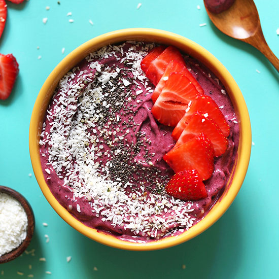

# My Go-To Smoothie Bowl (5 minutes!)

**Source:** https://minimalistbaker.com/favorite-smoothie-bowl-5-minutes/
**Author:** Minimalist Baker
**Yield:** ['1', '1 (smoothie bowl)']
**Prep time:** PT5M
**Total time:** PT5M
**Category:** ['Breakfast', 'Snack']
**Cuisine:** ['Gluten-Free', 'Vegan']
**Rating:** 4.67 (66 ratings/reviews)

My go-to 5-minute smoothie bowl with just 3 ingredients! Satisfying, nutrient-rich, and naturally sweet! A healthy, plant-based breakfast or snack.

## Ingredients

- 1 heaping cup organic frozen mixed berries
- 1 small ripe banana ((sliced and frozen))
- 2-3 Tbsp light coconut or almond milk
- 1 scoop plain or vanilla protein powder of choice*
- 1 Tbsp shredded unsweetened coconut ((desiccated))
- 1 Tbsp chia seeds
- 1 Tbsp hemp seeds
- Granola
- Fruit

## Preparation

1. Add frozen berries and banana to a blender and blend on low until small bits remain - see photo.
2. Add a bit of coconut or almond milk and protein powder (optional), and blend on low again, scraping down sides as needed, until the mixture reaches a soft serve consistency (see photo).
3. Scoop into 1-2 serving bowls (amount as original recipe is written // adjust if altering batch size) and top with desired toppings (optional). I prefer chia seeds, hemp seeds, and coconut, but strawberries, granola, and a nut or seed butter would be great here, too!
4. Best when fresh, though leftovers keep in the freezer for 1-2 weeks. Let thaw before enjoying.

## Nutrition supplied by source

- **Serving Size:** 1 smoothie bowl
- **Calories:** 214 kcal
- **Carbohydrate :** 47.5 g
- **Protein :** 2.8 g
- **Fat :** 2.5 g
- **Saturated Fat :** 1.6 g
- **Sodium :** 9 mg
- **Fiber :** 8.8 g
- **Sugar :** 25.9 g

## Tags

['Breakfast', 'Snack']; ['Gluten-Free', 'Vegan']; Smoothie Bowl
