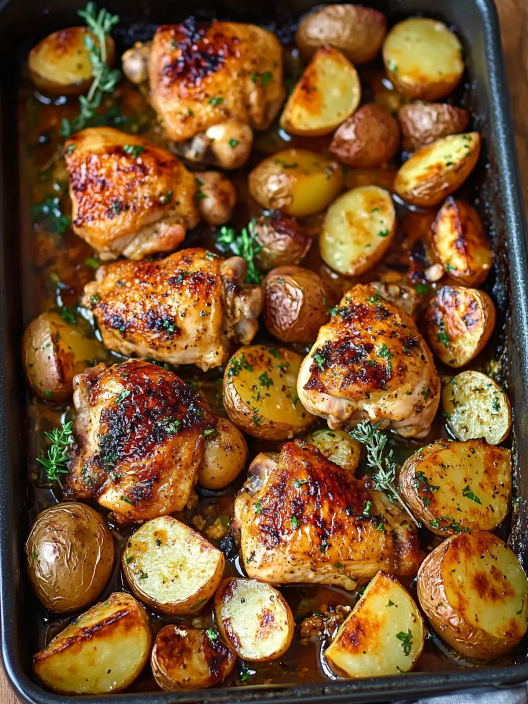

# One Pan Chicken and Potatoes for Effortless Cooking Fun

**Source:** https://www.recipesbycamille.com/one-pan-chicken-and-potatoes/
**Yield:** ['4', '4 servings']
**Prep time:** PT10M
**Cook time:** PT40M
**Total time:** PT55M
**Category:** ['Dinner']
**Cuisine:** ['American']

Enjoy a hassle-free meal with One Pan Chicken and Potatoes, featuring juicy chicken thighs and crispy potatoes, all seasoned to perfection.

## Ingredients

- 4 pieces chicken thighs and drumsticks (juicy and flavorful cuts)
- 4 cups potatoes (russet or Yukon gold, cut into even pieces)
- 2 tablespoons olive oil (can be swapped with canola oil)
- 1 teaspoon salt (adjust to taste)
- 1 teaspoon black pepper (adjust to taste)
- 1 tablespoon dried oregano (fresh oregano can be substituted)
- 4 cloves garlic (fresh minced is best)
- 2 tablespoons lemon juice (adjust to fit your taste)
- 1 tablespoon lemon zest (essential for flavor)
- 2 tablespoons tomato paste (or marinara sauce)
- 1 teaspoon paprika (adds smokiness)
- 2 tablespoons fresh parsley (for garnish)

## Preparation

### Main Steps

1. Preheat the oven to 400°F (200°C).
2. Whisk together olive oil, minced garlic, tomato paste, lemon juice, lemon zest, salt, oregano, black pepper, and paprika in a bowl.
3. Prepare your chicken and potatoes. Pat the chicken dry and cut the potatoes into uniform pieces.
4. Arrange the chicken and potatoes on a large baking sheet, ensuring they're spread out without overcrowding.
5. Pour the sauce over the chicken and potatoes, making sure everything is well-coated.
6. Bake uncovered for about 40 minutes, until the chicken reaches 165°F (74°C) and the potatoes are tender.
7. Rest the dish for 5 minutes, then garnish with fresh parsley before serving.

## Nutrition supplied by source

- **Serving Size:** 1 serving
- **Calories:** 450 kcal
- **Carbohydrate :** 35 g
- **Protein :** 30 g
- **Fat :** 20 g
- **Saturated Fat :** 5 g
- **Cholesterol :** 100 mg
- **Sodium :** 600 mg
- **Fiber :** 5 g
- **Sugar :** 2 g
- **Unsaturated Fat :** 12 g

## Tags

['Dinner']; ['American']; chicken recipes; comfort food; Easy Recipes; One Pan Chicken And Potatoes; one pan meals; Weeknight Meals
