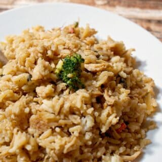

# One Pan Chicken Fried Rice Recipe

**Source:** https://nerdymamma.com/one-pan-chicken-fried-rice-recipe/?utm_source=Pinterest&utm_medium=organic
**Author:** NerdyMamma.com
**Yield:** 6
**Prep time:** PT5M
**Cook time:** PT10M
**Total time:** PT15M
**Category:** Entree
**Cuisine:** Chinese

It's like I was destined to one day make my own fast One Pan Chicken Fried Rice and post it on a blog somewhere--wait?! What?

## Ingredients

- 1 can of chicken breast
- 1 can mushrooms, chopped
- 1/2 cup broccoli, chopped into small pieces
- 1/2 cup carrots, julienne sliced
- 1/2 cup soy sauce, if you want this to be gluten-free, be sure to use gluten-free soy AND teriyaki
- 1/8 cup teriyaki sauce, if you want this to be gluten-free, be sure to use gluten-free soy AND teriyaki
- 2 tblspn minced garlic
- 1/2 cup chopped onion
- 2 tblspn sesame oil
- 6 cups steamed rice

## Preparation

1. Place wok or large pan over high heat.
2. Put sesame oil in the pan and while it's getting hot, open chicken and drain water off.
3. As soon as the sesame oil is hot, add the chicken and break it up using a spoon.
4. Add mushrooms, broccoli, carrots, onion and garlic, then stir until everything is lightly covered in the oil.
5. Add rice.
6. Immediately pour soy and teriyaki over the rice and stir until everything is combined--but do not over-stir.
7. You can turn the heat down just a little, but you want to keep it high and stir sparingly.
8. Remove after about 5-7 minutes and serve. It's up to you to find those cute little boxes, though, so you can fake your kids out and make them think you got take-out...LOL!

## Tags

Entree; Chinese
