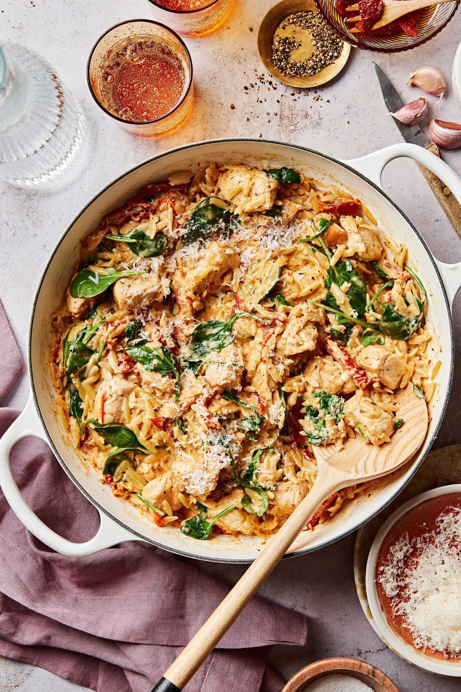

# One-Pan "Marry Me" Chicken Orzo

**Source:** https://kalejunkie.com/one-pan-marry-me-chicken-orzo/?utm_source=Pinterest&utm_medium=organic
**Yield:** ['6', '6 Servings']
**Category:** ['Main Course']
**Cuisine:** ['Italian']
**Rating:** 4.77 (138 ratings/reviews)

Tender chicken breasts paired with a creamy sun-dried tomato sauce and hearty orzo is such a good combination, it'll make you want to marry the person who made it for you! Introducing my One-Pan "Marry Me" Chicken Orzo, an easy, delicious take on the classic "Marry Me" chicken. This dish is the perfect weeknight dinner: it comes together with just one pan and and in a matter of minutes, making it the perfect cozy and comforting weeknight dinner.

## Ingredients

- 1.5 Pounds Boneless, Skinless Chicken breast (cut into cubes)
- 2 Tablespoons Olive Oil
- 4-5 Cloves Garlic (mashed)
- 3/4 Cup Sun-Dried Tomatoes (packed in oil and drained)
- 2 Teaspoons Italian seasoning
- 2 Teaspoons Paprika
- 1/2 Teaspoon Kosher Salt
- 1 Teaspoon Ground Black Pepper
- 1 Cup Orzo
- 2 3/4 Cups Chicken Broth or Water
- 3/4 Cup Full-Fat Coconut Milk or Heavy Cream
- 2 Large Handfuls Fresh Spinach
- 3/4 Cup Parmesan Cheese (freshly grated)

## Preparation

1. To make this recipe, start by preparing the chicken. Pat the chicken breasts dry with a paper towel and slice them into cubes. Set them aside while you prepare the skillet.
2. Heat a skillet, on the stove, over medium-high heat, and add in the oil.
3. Once the oil is hot, add in the chicken and cook for 2-3 minutes, until the edges start to cook.
4. Then, add in the sun-dried tomatoes, garlic, italian seasoning, paprika, sea salt, and black pepper, and cook for 3-4 more minutes.
5. Then, add in the orzo and broth and stir well.
6. Reduce the heat to medium, then cover the pan and allow it to cook for 12 minutes. Remove the cover every few minutes and stir, to ensure that the orzo doesn't stick to the bottom of the pan.
7. Once the orzo is cooked through, add in the coconut milk or heavy cream and spinach and stir until the spinach is wilted.
8. Finally, add in the freshly-grated parmesan cheese and stir one last time.
9. Once it's done, remove it from the heat, serve it immediately, and enjoy!

## Nutrition supplied by source

- **Calories:** 420 kcal
- **Carbohydrate :** 30 g
- **Protein :** 36 g
- **Fat :** 18 g
- **Saturated Fat :** 9 g
- **Trans Fat :** 0.01 g
- **Cholesterol :** 83 mg
- **Sodium :** 954 mg
- **Fiber :** 3 g
- **Sugar :** 7 g
- **Unsaturated Fat :** 7 g
- **Serving Size:** 1 serving

## Tags

['Main Course']; ['Italian']; Marry Me Chicken Orzo; One pot
