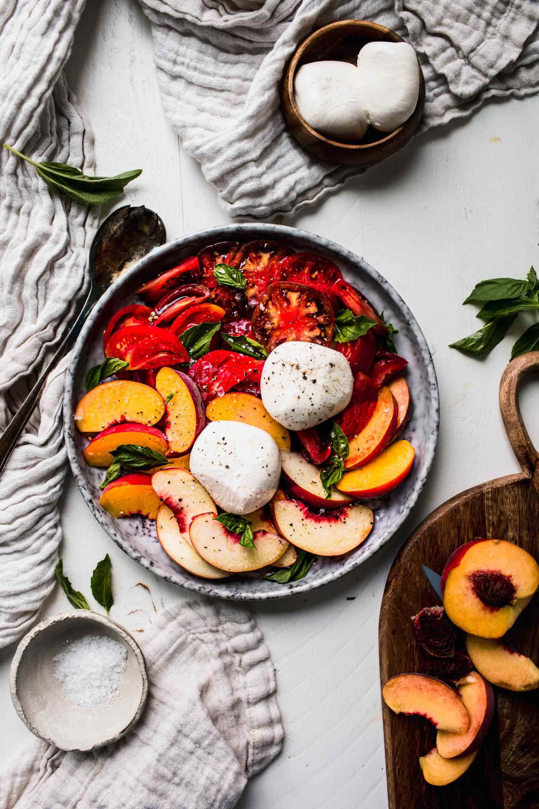

# Peach Caprese Salad

**Source:** https://www.platingsandpairings.com/peach-caprese-salad/?utm_source=Pinterest&utm_medium=organic
**Yield:** ['4', '4 people']
**Prep time:** PT15M
**Total time:** PT15M
**Category:** ['Salad']
**Cuisine:** ['Italian']
**Rating:** 5 (4 ratings/reviews)

This fresh and tangy Peach Caprese Salad features sweet peaches, creamy burrata cheese, and juicy tomatoes. A perfect blend of summery flavors, this simple yet delicious salad is the ideal late summer side dish!

## Ingredients

- 2 balls burrata cheese (about 4 ounces)
- 2-3 ripe medium peaches (cored and cut into wedges)
- 2-3 pounds ripe tomatoes (cut into wedges)
- Flaky sea salt
- ¼ cup packed fresh basil leaves (chopped)
- Black pepper
- 3 Tablespoons extra-virgin olive oil
- 2 Tablespoons white balsamic vinegar
- 1 teaspoon granulated sugar

## Preparation

1. Place tomatoes and peaches on a serving platter and season generously with flaky sea salt.
2. Nestle the balls of burrata into the peaches and tomatoes.
3. Prepare the dressing: In a small glass jar, combine dressing ingredients, cover and shake to combine. Drizzle over the tomatoes and peaches.
4. Top the salad with basil and black pepper. Enjoy!

## Nutrition supplied by source

- **Calories:** 175 kcal
- **Carbohydrate :** 18 g
- **Protein :** 3 g
- **Fat :** 11 g
- **Saturated Fat :** 2 g
- **Cholesterol :** 1 mg
- **Sodium :** 13 mg
- **Fiber :** 4 g
- **Sugar :** 14 g
- **Unsaturated Fat :** 9 g
- **Serving Size:** 1 serving

## Tags

['Salad']; ['Italian']; burrata caprese; caprese; peach caprese
