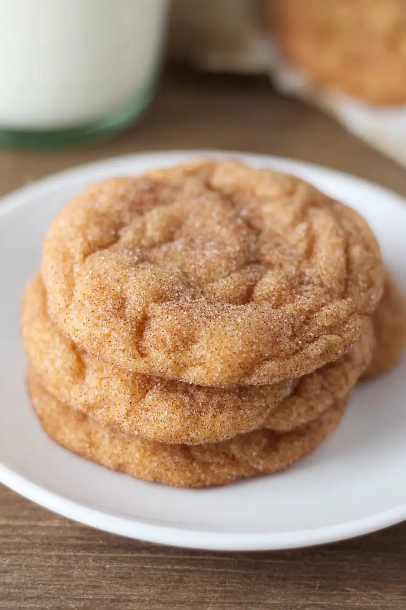

# Perfect Pumpkin Spice Cookies - theamazingfood

**Source:** https://theamazingfood.com/perfect-pumpkin-spice-cookies-26141/?utm_source=Pinterest&utm_medium=organic
**Author:** Mila
**Yield:** 4
**Prep time:** PT15M
**Cook time:** PT8M
**Total time:** PT143M
**Rating:** 4.7 (171 ratings/reviews)

Fall baking has always been my favorite time of year. I love the smell of cinnamon and nutmeg filling up the kitchen, and my kids get excited when they come

## Ingredients

- 2 1/2 cups all-purpose flour, spooned and leveled
- 2 tsp cornstarch
- 1/2 tsp cream of tartar
- 3/4 tsp baking soda
- 1/4 tsp salt
- 2 tsp ground cinnamon
- 1/2 tsp ground nutmeg
- 1/8 tsp ground cloves
- 3/4 cup unsalted butter, at room temperature
- 3/4 cup packed light brown sugar
- 1/2 cup white sugar
- 1 large egg
- 2 tsp pure vanilla extract
- 1/2 cup plain canned pumpkin (not pumpkin pie blend)
- 1/4 cup white sugar
- 1 1/2 tsp ground cinnamon

## Preparation

1. [No instructions extracted]

## Tags

[Add personal tags]
