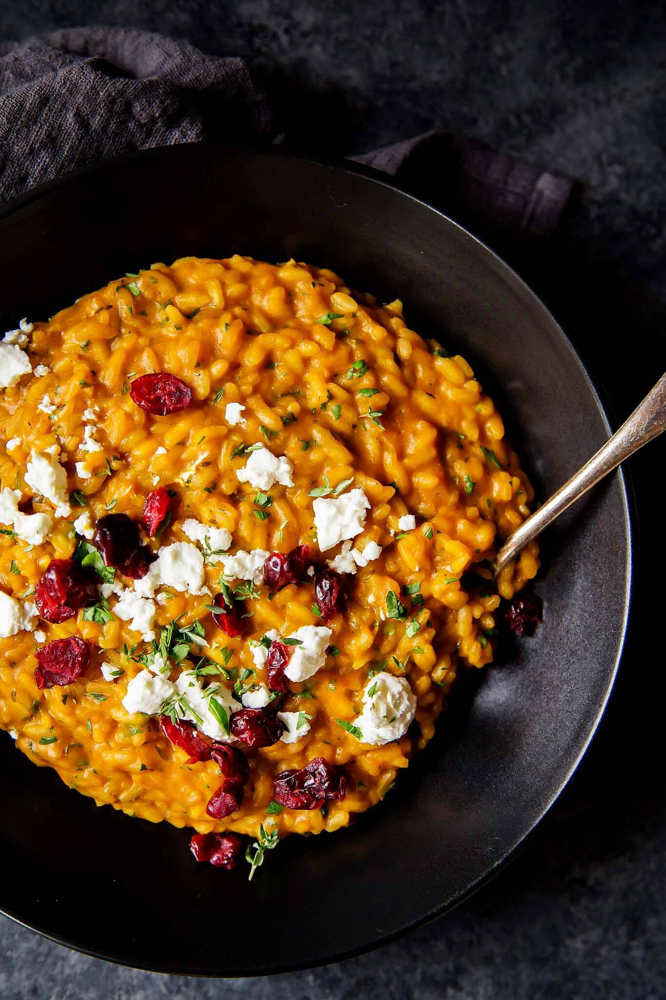

# Pumpkin Risotto Recipe

**Source:** https://www.platingsandpairings.com/pumpkin-risotto-with-goat-cheese-dried-cranberries/?utm_source=Pinterest&utm_medium=organic
**Yield:** ['4']
**Prep time:** PT5M
**Cook time:** PT30M
**Total time:** PT35M
**Category:** ['Main Dish']
**Cuisine:** ['Italian']
**Rating:** 4.97 (120 ratings/reviews)

This Pumpkin Risotto with Goat Cheese and Cranberries is a perfect fall comfort food. It’s rich and creamy and perfect for an elegant weeknight meal. Or try serving this to your vegetarian guests at Thanksgiving.

## Ingredients

- 4 cups bone broth (or vegetable stock)
- 1 cup canned pumpkin puree
- 2 tablespoons unsalted butter
- 1 shallot (minced)
- 1 teaspoon kosher salt
- 1 teaspoon chopped fresh thyme
- 1 1/2 cups Arborio rice
- 1 teaspoon white wine vinegar
- 1/2 cup grated Parmesan cheese
- 1/4 cup chopped fresh flat-leaf parsley
- 1/4 teaspoon nutmeg
- Fresh ground black pepper
- 1 cup crumbled goat cheese
- 1/2 cup dried cranberries

## Preparation

1. In a medium saucepan, whisk together the stock and pumpkin over medium heat. Bring to a simmer and reduce the heat to low. Cover and keep warm.
2. Melt the butter in a large dutch oven or saucepan over medium heat. Once the foaming subsides, add the shallot and salt. Cook until softened, 2-3 minutes. Add the thyme and rice and cook for one minute longer.
3. Add the white wine vinegar and a ladle of warm stock and cook, stirring occasionally, until the liquid has evaporated. Add another ladle of stock, and continue cooking until evaporated again. Continue cooking, adding a ladle of stock at a time, and allowing to evaporate in between each addition. Cook until the rice is done, but has a bite to it, it should be creamy in texture, and will take about 20-25 minutes.
4. Mix in the parmesan, half of the parsley, and nutmeg. Season to taste with salt and pepper. Top with the remaining parsley, goat cheese and dried cranberries. Serve immediately.

## Nutrition supplied by source

- **Calories:** 478 kcal
- **Carbohydrate :** 78 g
- **Protein :** 19 g
- **Fat :** 10 g
- **Saturated Fat :** 6 g
- **Cholesterol :** 26 mg
- **Sodium :** 867 mg
- **Fiber :** 4 g
- **Sugar :** 12 g
- **Serving Size:** 1 serving

## Tags

['Main Dish']; ['Italian']; pumpkin risotto
