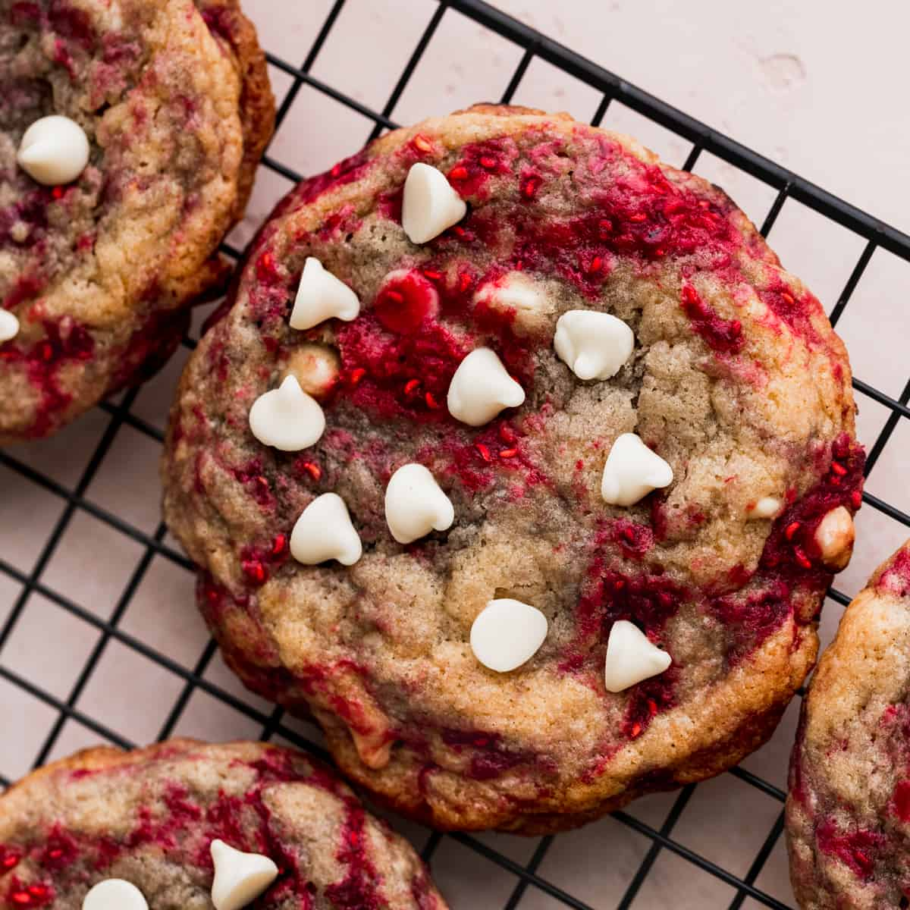

# Raspberry White Chocolate Cookies

**Source:** https://stephaniessweets.com/raspberry-white-chocolate-cookies/?utm_source=Pinterest&utm_medium=organic
**Author:** Stephanie Rutherford
**Yield:** ['15', '15 large cookies']
**Prep time:** PT15M
**Cook time:** PT14M
**Total time:** PT29M
**Category:** ['Dessert']
**Cuisine:** ['American']
**Rating:** 5 (50 ratings/reviews)

These raspberry white chocolate cookies are a no chill recipe. They are a chewy and buttery cookies full of white chocolate chips and frozen raspberries.

## Ingredients

- 2 1/2 cups All-purpose flour
- 1/2 tsp Baking powder
- 1/2 tsp Baking soda
- 1 tsp Salt
- 1 cup Unsalted butter (melted)
- 3/4 cup Brown sugar (packed light or dark)
- 3/4 cup White granulated sugar
- 1 tsp Pure vanilla extract
- 1 Large egg (room temperature)
- 1 Egg yolk (room temperature)
- 1 cup Frozen raspberries (slightly thawed)
- 3/4 cup White chocolate chips (Plus more on top of the cookies)

## Preparation

1. Melt the butter in the microwave. Let it cool for 10 minutes before using. At the same time, pull the frozen raspberries out to start to thaw.
2. Preheat oven to 350°F. Prep two cookie sheets with parchment paper.
3. In a mixing bowl, sift the flour. Add in baking power, baking soda, and salt.
4. In a separate bowl, mix the melted butter, sugar, and brown sugar. Add in the vanilla, egg, and egg yolk.
5. Add the dry ingredients. Use a rubber spatula to fold the dry ingredients in. Add in the frozen raspberries and white chocolate chips.
6. Use a large cookie scoop to scoop 3 oz cookie dough balls. Place 6 cookie dough balls per cookie sheet.
7. Bake the cookies for 13-15 minutes. Bake until the edges are light golden brown.
8. Top the warm cookies with more white chocolate chips. Let it sit for 5 minutes before transferring to a cooling rack.

## Nutrition supplied by source

- **Calories:** 318 kcal
- **Carbohydrate :** 42 g
- **Protein :** 3 g
- **Fat :** 16 g
- **Saturated Fat :** 10 g
- **Trans Fat :** 1 g
- **Cholesterol :** 47 mg
- **Sodium :** 220 mg
- **Fiber :** 1 g
- **Sugar :** 26 g
- **Unsaturated Fat :** 5 g
- **Serving Size:** 1 serving

## Tags

['Dessert']; ['American']; chewy; cookies; no chill; raspberries; white chocolate cookies
