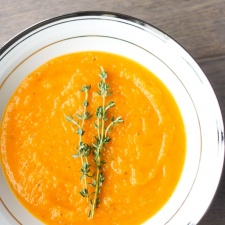

# Roasted Butternut Squash Soup

**Source:** https://www.aheadofthyme.com/2015/12/roasted-butternut-squash-soup/?utm_source=Pinterest&utm_medium=organic
**Author:** Sam | Ahead of Thyme
**Yield:** ['8', '8 servings (approx. 10 cups)']
**Prep time:** PT15M
**Cook time:** PT1H10M
**Total time:** PT1H25M
**Category:** Soup
**Cuisine:** American
**Rating:** 4.9 (74 ratings/reviews)

This easy, delicious, vegan roasted butternut squash soup sums up the taste of the holidays in one spoon. Rosemary, sage and thyme, need I say more?

## Ingredients

- 1 large butternut squash
- 2 carrots
- 3 stalks celery
- 1 large onion
- 5 cloves garlic
- 6 sage leaves
- 6 sprigs of thyme
- 1 sprig of rosemary
- 1/4 teaspoon cayenne red pepper powder (or less to taste)
- salt and pepper (to taste)
- 2 tablespoons olive oil
- 3 1/2 cups vegetable stock

## Preparation

1. Preheat the oven to 350 F.
2. Peel, pit and chop the butternut squash into 1 inch squares. Add to a large baking sheet or roasting pan.
3. Chop the carrots, celery and onions in big chunks and add to the pan. Peel the garlic and add cloves whole or halved.
4. Add the herbs (easier to puree later if stems are removed), red pepper powder, salt and pepper. Add olive oil and toss to coat.
5. Roast for 1 hour until veggies are soft and tender (check the carrots in particular). If veggies are not soft, cook for another 15 minutes.
6. Transfer cooked vegetables to food processor (or blender) with 1 cup of vegetable stock and puree until smooth and creamy, or until desired consistency is reached. You may need to do this in a couple batches. Note: If stems are still on the herbs, remove before pureeing as they do not process very well (particularly the thyme)
7. Pour mixture into a large saucepan. Add the remaining vegetable stock and stir well. Simmer on low for 10 minutes. If the consistency of the soup is too thick, just thin it out with some water until you reach your desired consistency.
8. Garnish with additional fresh herbs (optional) and serve!

## Nutrition supplied by source

- **Serving Size:** 1 cup
- **Calories:** 59 calories
- **Sugar :** 3.1 g
- **Sodium :** 459.6 mg
- **Fat :** 3 g
- **Saturated Fat :** 0.5 g
- **Trans Fat :** 0 g
- **Carbohydrate :** 8.1 g
- **Fiber :** 1.9 g
- **Protein :** 0.9 g
- **Cholesterol :** 0 mg

## Tags

Soup; American; butternut squash soup; roasted butternut squash soup; vegan butternut squash soup; butternut squash recipe; thanksgiving soup
