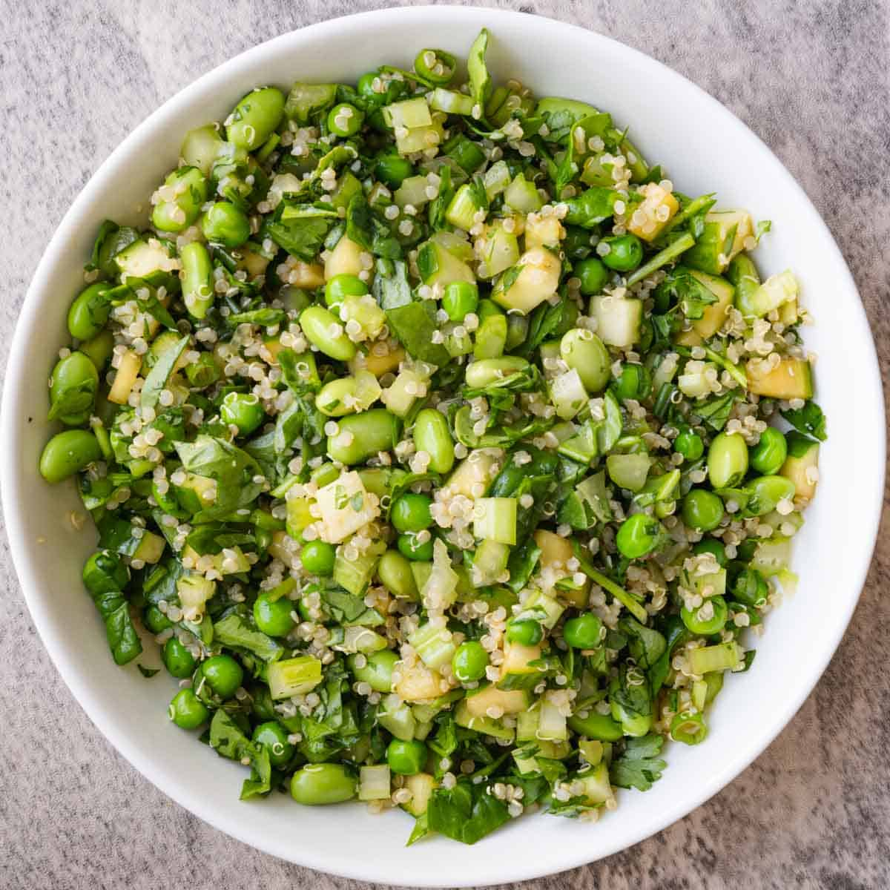

# Salad with Asian Dressing (High Protein)

**Source:** https://cookingforpeanuts.com/salad-with-asian-dressing/?utm_source=Pinterest&utm_medium=organic
**Yield:** ['4', '4 people']
**Prep time:** PT15M
**Total time:** PT15M
**Category:** ['Main Course', 'Salad']
**Cuisine:** ['Vegan']
**Rating:** 5 (18 ratings/reviews)

This high-protein Salad with Asian Dressing is crunchy, healthy, and budget-friendly. Meal prep this quick and easy vegan salad for the week.

## Ingredients

- 1/4 cup tamari (or soy sauce (preferably low sodium))
- 1/4 cup plus 1 tablespoon rice vinegar
- 1 tablespoon plus 1 teaspoon maple syrup
- 1 tablespoon toasted sesame oil (or sesame oil)
- 2 cups chopped cucumber ((about 1 large))
- 2 cups chopped celery ((about 6 ribs))
- 2 cups sweet green peas ((frozen, thawed))
- 2 cups shelled edamame ((frozen, thawed))
- 2 cups cooked quinoa ((2/3 cups dry, cooked))
- 2 cups baby spinach (chopped)
- 1/2 cup chopped cilantro
- 1/2 cup chopped scallion
- 2 tablespoons plus 2 teaspoons toasted sesame seeds
- Fresh lime juice (to taste)

## Preparation

1. Make the dressing: Whisk the tamari, rice vinegar, maple syrup, and toasted sesame oil in a medium bowl.
2. Option 1 (For Meal-Prep Salad Jars): To make 4 (16-ounce) mason jars: Add one-fourth of the dressing to each jar. Then add ½ cup cucumber, ½ cup celery, ½ cup green peas, ½ cup edamame, ½ cup quinoa, ½ cup spinach, 2 tablespoons cilantro, 2 tablespoons scallion, and 2 teaspoons sesame seeds to each jar. Refrigerate for up to 4 days. Shake before serving. Add fresh lime juice to taste. Or make 2 (32-ounce) jars and double the ingredients for a high-protein, more satisfying main dish.
3. Option 2: Transfer the cucumber, celery, green peas, edamame, quinoa, spinach, cilantro, scallion, and sesame seeds to a large bowl. Add the dressing and mix to combine.

## Nutrition supplied by source

- **Calories:** 386 kcal
- **Carbohydrate :** 48 g
- **Protein :** 21 g
- **Fat :** 14 g
- **Saturated Fat :** 2 g
- **Sodium :** 398 mg
- **Fiber :** 14 g
- **Sugar :** 12 g
- **Unsaturated Fat :** 10 g
- **Serving Size:** 1 serving

## Tags

['Main Course', 'Salad']; ['Vegan']; high protein; meal prep; quick
