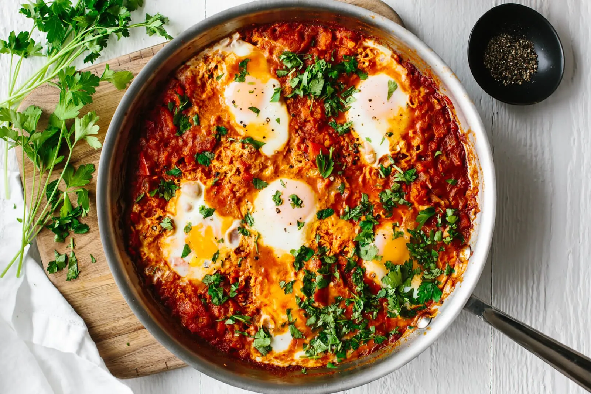

# Shakshuka Recipe (Easy & Traditional)

**Source:** https://downshiftology.com/recipes/shakshuka/?utm_source=Pinterest&utm_medium=organic
**Author:** Lisa Bryan
**Yield:** ['6', '6 servings']
**Prep time:** PT10M
**Cook time:** PT20M
**Total time:** PT30M
**Category:** ['Breakfast', 'Main Meal']
**Cuisine:** ['Mediterranean', 'Middle Eastern']
**Rating:** 4.94 (530 ratings/reviews)

Shakshuka is a North African and Middle Eastern meal of poached eggs in a simmering tomato sauce with spices. It's easy, healthy and takes less than 30 minutes to make. Watch the video below to see how I make it in my kitchen!

## Ingredients

- 2 tablespoons olive oil
- 1 medium onion (diced)
- 1 red bell pepper (seeded and diced)
- 4 garlic cloves (finely chopped)
- 2 teaspoon paprika
- 1 teaspoon cumin
- ¼ teaspoon chili powder
- 1 (28-ounce can) whole peeled tomatoes
- 6 large eggs
- salt and pepper (to taste)
- 1 small bunch fresh cilantro (chopped)
- 1 small bunch fresh parsley (chopped)

## Preparation

1. Heat olive oil in a large sauté pan on medium heat. Add the chopped bell pepper and onion and cook for 5 minutes or until the onion becomes translucent.
2. Add garlic and spices and cook an additional minute.
3. Pour the can of tomatoes and juice into the pan and break down the tomatoes using a large spoon. Season with salt and pepper and bring the sauce to a simmer.
4. Use your large spoon to make small wells in the sauce and crack the eggs into each well. Cook the eggs for 5 to 8 minutes, or until the eggs are done to your liking. You can also cover the pan with a lid to expedite the eggs cooking.
5. Garnish with chopped cilantro and parsley before serving.

## Nutrition supplied by source

- **Calories:** 146 kcal
- **Carbohydrate :** 10 g
- **Protein :** 7 g
- **Fat :** 9 g
- **Saturated Fat :** 2 g
- **Trans Fat :** 1 g
- **Cholesterol :** 164 mg
- **Sodium :** 256 mg
- **Fiber :** 2 g
- **Sugar :** 5 g
- **Unsaturated Fat :** 6 g
- **Serving Size:** 1 serving

## Tags

['Breakfast', 'Main Meal']; ['Mediterranean', 'Middle Eastern']; shakshuka; Shakshuka recipe
