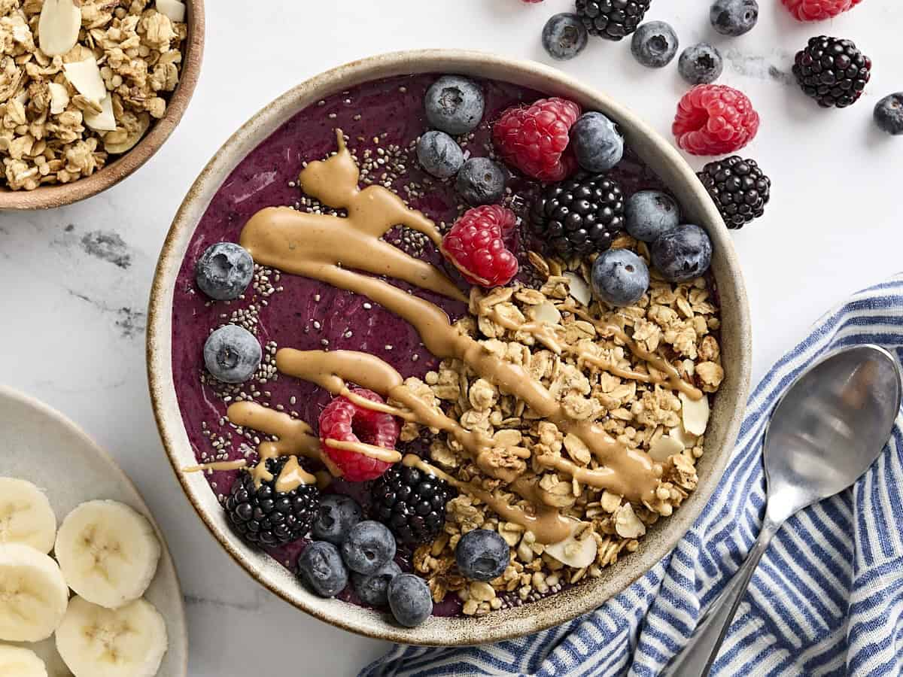

# Smoothie Bowl Recipe

**Source:** https://www.budgetbytes.com/how-to-make-smoothie-bowls/
**Yield:** ['2', '2 bowls (about 1 cup of smoothie + ¼ cup toppings each)']
**Prep time:** PT10M
**Total time:** PT10M
**Category:** ['Breakfast']
**Cuisine:** ['General']
**Rating:** 5 (3 ratings/reviews)

Learn How to Make Smoothie Bowls the right way and add all your favorite toppings to create a cheap, healthy, and super easy breakfast or snack!

## Ingredients

- 1 cup mixed berries, frozen ($2.08)
- 1 ripe banana, sliced and frozen (about 1 cup) ($0.26)
- ¼ cup almond milk* ($0.30)
- ½ Tbsp chia seeds ($0.07)
- ¼ cup granola ($0.48)
- ¼ cup berries ($0.52)
- 1 ½ Tbsp peanut butter, melted ($0.09)

## Preparation

1. Add frozen mixed berries, frozen banana, and almond milk to the blender.
2. Blend, stopping often to scrape down the inside of the blender to make sure the ingredients catch the blade. Blend and scrape down the blender as often as needed until the perfect consistency is reached.
3. Pour the smoothie (it will be THICK) into your favorite bowls and top with your favorite ingredients. I chose chia seeds, granola, more berries, and some melted peanut butter. Enjoy immediately!

## Nutrition supplied by source

- **Serving Size:** 1 bowl with toppings
- **Calories:** 278 kcal
- **Carbohydrate :** 43 g
- **Protein :** 6 g
- **Fat :** 11 g
- **Sodium :** 99 mg
- **Fiber :** 7 g

## Tags

['Breakfast']; ['General']; smoothie bowls
