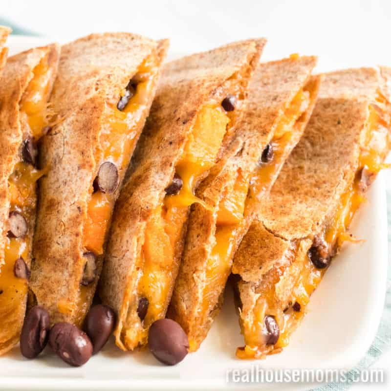

# Sweet Potato & Black Bean Quesadilla

**Source:** https://realhousemoms.com/sweet-potato-black-bean-quesadilla/?utm_source=Pinterest&utm_medium=organic
**Yield:** ['5', '5 quesadillas']
**Prep time:** PT10M
**Cook time:** PT40M
**Total time:** PT50M
**Category:** ['Main Dish']
**Cuisine:** ['Mexican']
**Rating:** 4.73 (11 ratings/reviews)

Sweet Potato & Black Bean Quesadillas are a nutritious meal idea. Packed with protein and fiber, it's a great choice for your Meatless Monday menu!

## Ingredients

- 1 large sweet potato
- 1 tablespoon olive oil
- 1 1/2 teaspoon ground cumin
- 1 teaspoon onion powder
- 1 teaspoon garlic powder
- 1 teaspoon salt
- 1 teaspoon black pepper
- 15 ounces black beans (drained and rinsed)
- 10 burrito-sized whole wheat tortillas
- 2 1/2 cups Mexican blend cheese

## Preparation

1. Preheat oven to 375 degrees F.
2. Peel and chop the sweet potato into 1/2-inch cubes.
3. Toss sweet potato cubes with olive oil, cumin, onion powder, garlic powder, salt, and pepper in a mixing bowl.
4. Place sweet potato on a parchment paper-lined baking sheet in a single layer.
5. Bake in oven for 30 minutes or until potatoes are fork tender.
6. Set a large skillet on medium-high heat.
7. Place one tortilla in the pan and sprinkle1/4 cup of cheese all over the tortilla.
8. Next, add a layer of beans and sweet potatoes. Add another 1/4 cup cheese on top.
9. Place another tortilla on top of the filling.
10. When cheese begins to melt, flip the quesadilla and toast the other side until golden brown.
11. Remove from heat and cut into 8 slices, like a pizza. Repeat with remaining ingredients.

## Nutrition supplied by source

- **Calories:** 823 kcal
- **Carbohydrate :** 104 g
- **Protein :** 34 g
- **Fat :** 29 g
- **Saturated Fat :** 14 g
- **Cholesterol :** 53 mg
- **Sodium :** 1795 mg
- **Fiber :** 20 g
- **Sugar :** 10 g
- **Unsaturated Fat :** 6 g
- **Serving Size:** 1 serving

## Tags

['Main Dish']; ['Mexican']; black beans; cheese; quesadilla; sweet potato
