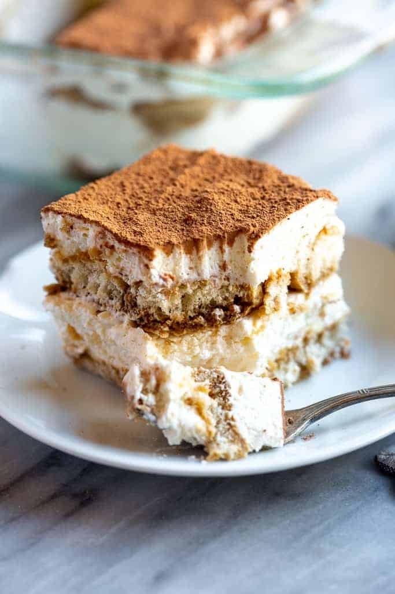

# Tiramisu

**Source:** https://tastesbetterfromscratch.com/easy-tiramisu/
**Yield:** ['9']
**Prep time:** PT10M
**Total time:** PT10M
**Category:** ['Dessert']
**Cuisine:** ['Italian']
**Rating:** 4.97 (7114 ratings/reviews)

Creamy, delicious and unbelievably EASY tiramisu recipe made with coffee soaked lady fingers, sweet and creamy mascarpone, and cocoa powder dusted on top.

## Ingredients

- 1 1/2 cups heavy whipping cream ((360 ml))
- 8 ounce container mascarpone cheese (,room temperature (225 g))
- 1/3 cup granulated sugar ((67 g))
- 1 teaspoon vanilla extract ((5 ml))
- 1 1/2 cups cold espresso (, prepared (360 ml))
- 3 Tablespoons coffee flavored liqueur (,optional (Kahlua or DaVinci brands) (45 ml))
- 1 package Lady Fingers (,Savoiardi brand can be found in the cookie aisle at your local grocery store, or online)
- Cocoa powder for dusting the top

## Preparation

1. Add whipping cream to a mixing bowl and beat on medium speed with electric mixers (or use a stand mixer). Slowly add sugar and vanilla and continue to beat until stiff peaks. Add mascarpone cheese and fold in until combined. Set aside.
2. Add coffee and liqueur to a shallow bowl. Dip the lady fingers in the coffee (Don't soak them--just quickly dip them on both sides to get them wet) and lay them in a single layer on the bottom of an 8x8'' or similar size pan.
3. Smooth half of the mascarpone mixture over the top. Add another layer of dipped lady fingers. Smooth remaining mascarpone cream over the top.
4. Dust cocoa powder generously over the top (I use a fine mesh strainer to do this). Refrigerate for at least 3-4 hours or up to overnight before serving.

## Nutrition supplied by source

- **Calories:** 297 kcal
- **Carbohydrate :** 26 g
- **Protein :** 5 g
- **Fat :** 18 g
- **Saturated Fat :** 11 g
- **Cholesterol :** 88 mg
- **Sodium :** 77 mg
- **Fiber :** 1 g
- **Sugar :** 11 g
- **Unsaturated Fat :** 3 g
- **Serving Size:** 1 serving

## Tags

['Dessert']; ['Italian']; best tiramisu recipe; classic tiramisu recipe; easy tiramisu recipe; how to make tiramisu; lady finger cookies; tiramisu; tiramisu alcohol; tiramisu cake; tiramisu cake recipe; tiramisu cheesecake; tiramisu ingredients; tiramisu near me; tiramisu origin; tiramisu recipe; tiramisu without eggs
