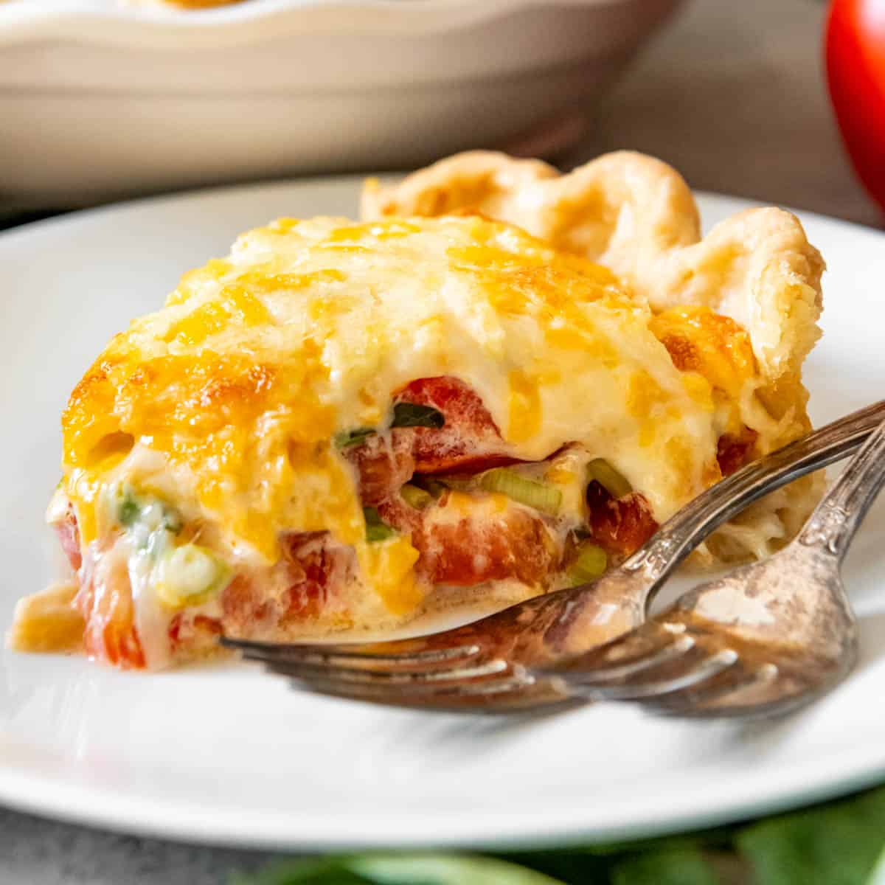

# Tomato Pie Recipe (Southern Style)

**Source:** https://houseofnasheats.com/southern-tomato-pie/?utm_source=Pinterest&utm_medium=organic
**Yield:** ['10', '10 servings']
**Prep time:** PT20M
**Cook time:** PT40M
**Total time:** PT60M
**Category:** ['Main Course']
**Cuisine:** ['American']
**Rating:** 4.83 (207 ratings/reviews)

This savory Southern Tomato Pie is made with summer-ripe tomatoes, fresh basil leaves, and topped with a tasty cheese & mayo topping!

## Ingredients

- 1 unbaked pie crust
- 4-5 tomatoes, (sliced)
- 1 teaspoon salt
- 10 fresh basil leaves, (chopped (about 1/4 cup))
- 1/2 cup chopped green onion
- 1 clove garlic, (minced)
- 1 cup grated mozzarella cheese
- 1 cup grated sharp cheddar cheese
- 3/4 cup mayonnaise
- Freshly ground black pepper, (to taste)

## Preparation

1. Heat oven to 375°F. Line a baking sheet with a few layers of paper towels. Slice the tomatoes and lay on the paper towels in a single layer, then sprinkle with the salt to draw out the tomato juices. Let sit for 10-15 minutes, then use fresh paper towels to pat-dry the tomatoes and remove move of the excess juice so the pie doesn't turn out soggy.
2. Roll out pie crust and use it to line a pie plate. Crimp the edges and poke holes in the bottom of the crust using the tines of a fork. Par-bake the crust for 10 minutes. Since this won't bake all the way before being filled, it shouldn't shrink too badly, so there is no need for pie weights in my experience.
3. While the crust bakes, combine the basil, green onion, and garlic in a bowl and stir. In a separate bowl, combine the mozzarella cheese, sharp cheddar cheese, mayonnaise and season with freshly ground black pepper. Stir to combine.
4. When the pie crust has baked for 10 minutes, layer half of the tomatoes on the bottom of the crust, then sprinkle with half of the basil-onion mixture. Layer the remaining tomatoes on top and sprinkle with the remaining basil-onion mixture. Spread the cheese mixture over the top of the pie.
5. Decrease the oven temperature to 350 degrees F, then return the pie to the oven and bake for 30 minutes, uncovered, until the cheese begins to get lightly brown on top. Let rest for 10 minutes, then slice and serve warm.

## Nutrition supplied by source

- **Calories:** 282 kcal
- **Carbohydrate :** 11 g
- **Protein :** 7 g
- **Saturated Fat :** 7 g
- **Cholesterol :** 28 mg
- **Sodium :** 552 mg
- **Fiber :** 1 g
- **Sugar :** 2 g
- **Fat :** 23 g
- **Trans Fat :** 1 g
- **Unsaturated Fat :** 15 g
- **Serving Size:** 1 serving

## Tags

['Main Course']; ['American']; alabama tomato pie; homemade pie crust; southern tomato pie; tomato pie
