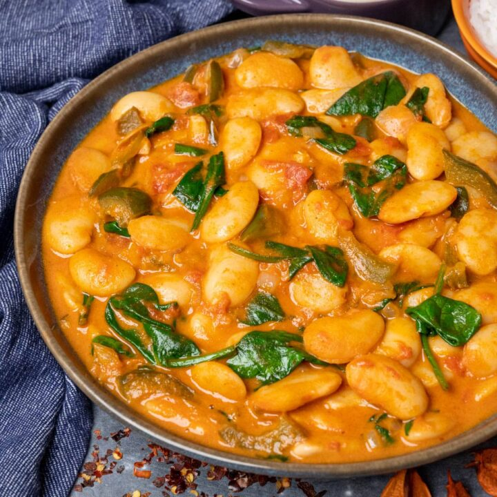

# Vegan Butter Bean Curry

**Source:** https://vegancocotte.com/vegan-butter-bean-curry/?utm_source=Pinterest&utm_medium=organic&utm_campaign=grow-social-pro
**Author:** Paris | Vegan Cocotte
**Yield:** 4
**Prep time:** PT10M
**Cook time:** PT30M
**Total time:** PT40M
**Category:** Curry
**Cuisine:** Indian
**Rating:** 4.5 (31 ratings/reviews)

This quick and easy vegan butter bean curry is just the perfect recipe for an easy weeknight dinner. It's a low-fat, plant-based curry full of protein and flavour that pairs perfectly with rice or naan bread.

## Ingredients

- 1 tablespoon sunflower oil
- 1 medium onion, finely chopped
- 1 medium green pepper, sliced
- 2 large garlic cloves, finely chopped
- 1/2 tablespoon fresh ginger, grated
- 1 teaspoon ground cumin
- 1/2 teaspoon chilli powder
- 1/2 teaspoon ground coriander
- 1/4 teaspoon red chilli flakes
- 1 x 400 g (14 oz) can chopped tomatoes
- 2 x 400 g (14 oz) cans butter beans, drained and rinsed
- 1 x 400 ml (13.5 fl. oz.) can light coconut milk
- 50 g (2 cups) baby spinach
- Salt and pepper to taste

## Preparation

1. Heat the oil in a large, deep pan and sauté the onion for 3-4 minutes over medium heat. Add the green pepper and continue to cook for 2-3 minutes until it softens a bit.
2. Stir in the garlic and ginger and cook for another minute until fragrant. Add the ground cumin, chilli powder, ground coriander and red chilli flakes and stir to combine.
3. Continue to cook for 1 minute, then stir in the chopped tomatoes, butter beans and coconut milk. Bring to a simmer, then lower the heat and simmer for 15 minutes, covered.
4. Add the baby spinach and simmer for 1-2 minutes until it wilts. Season to taste and serve over your favourite rice or with naan.

## Nutrition supplied by source

- **Calories:** 371 calories
- **Carbohydrate :** 53 grams carbohydrates
- **Cholesterol :** 0 milligrams cholesterol
- **Fat :** 12 grams fat
- **Fiber :** 16 grams fiber
- **Protein :** 18 grams protein
- **Saturated Fat :** 7 grams saturated fat
- **Serving Size:** 1
- **Sodium :** 113 milligrams sodium
- **Sugar :** 11 grams sugar
- **Trans Fat :** 0 grams trans fat
- **Unsaturated Fat :** 4 grams unsaturated fat

## Tags

Curry; Indian; butter bean curry; lima beans recipe Indian; butter bean coconut curry
