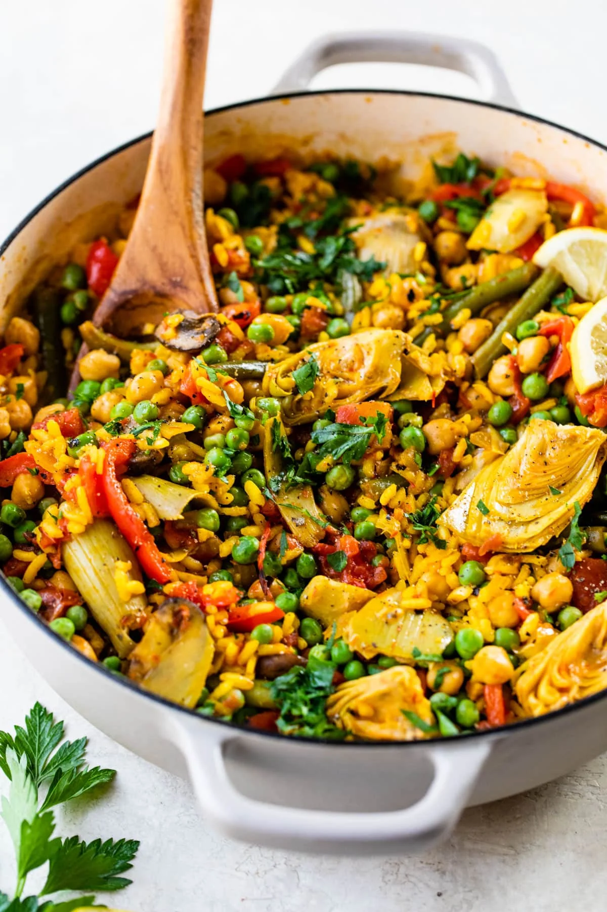

# Vegetable Paella

**Source:** https://thealmondeater.com/vegetable-paella/?utm_source=Pinterest&utm_medium=organic
**Yield:** ['6']
**Prep time:** PT15M
**Cook time:** PT45M
**Total time:** PT60M
**Category:** ['dinner']
**Cuisine:** ['American']
**Rating:** 5 (1 ratings/reviews)

This Vegetable Paella recipe is easy to make in one pot with vibrant veggies, protein-packed chickpeas, and aromatic spiced rice. It’s ready in about 1 hour and can be enjoyed as a mouthwatering Spanish-inspired vegetarian and vegan-friendly main course!

## Ingredients

- 4 tbsp olive oil (divided)
- 1 medium yellow onion (diced)
- 1 red bell pepper (stemmed, seeded and sliced into ½” strips)
- 1 cup bella mushrooms (sliced)
- 1 cup green beans (trimmed and cut in half)
- 6 garlic cloves (minced)
- 1 tsp salt (plus more to taste)
- 1/2 tsp black pepper
- 1 tsp smoked paprika
- 1/2 tsp paprika
- 1 tsp saffron threads (crumbled together)
- 1/2 cup dry white wine (or sub broth)
- 1 1/2 cups short grain rice
- 15 oz. chickpeas (drained and rinsed)
- 15 oz. fire roasted diced tomatoes (drained)
- 3/4 cup frozen peas (thawed)
- 14 oz. roasted or grilled artichokes (drained & quartered; from a can or jar )
- 2 1/2 cups vegetable broth
- 1/4 cup chopped fresh parsley (plus more for garnish )
- 1 lemon (juiced)

## Preparation

1. Grab a large skillet with a lid and heat 3 tbsp olive oil over medium-high heat. Add the onion, bell pepper, mushrooms, and green beans and cook until softened, about 5-7 minutes. Then add the garlic, salt, pepper, smoked paprika, paprika, and saffron and cook for another 2 minutes.
2. Add in the wine and cook for 3-4 minutes or until the liquid has almost completely absorbed. Next add the rice and stir to combine everything together, about 2 minutes.
3. Stir in the chickpeas, tomatoes, peas, artichokes, and broth and bring to a low boil. Once boiling, reduce heat, cover, and cook for about 20-25 minutes.
4. Once the rice is done cooking, remove the lid and let the mixture cook for another 5 minutes or until the rice starts to stick to the bottom and is browned. Then add in the parsley, lemon juice, and additional 1 tbsp olive oil. Enjoy!

## Nutrition supplied by source

- **Serving Size:** 1 g
- **Calories:** 494 kcal
- **Carbohydrate :** 81 g
- **Protein :** 15 g
- **Fat :** 12 g
- **Saturated Fat :** 2 g
- **Sodium :** 964 mg
- **Fiber :** 14 g
- **Sugar :** 11 g
- **Unsaturated Fat :** 9 g

## Tags

['dinner']; ['American']; vegetable paella
