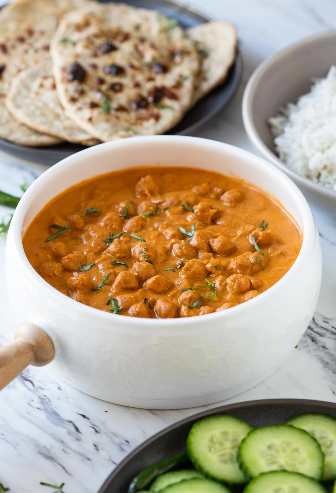

# Vegetarian Chickpea Tikka Masala

**Source:** https://www.watchwhatueat.com/healthy-chickpea-tikka-masala/?utm_source=Pinterest&utm_medium=organic
**Yield:** ['4']
**Prep time:** PT15M
**Cook time:** PT20M
**Total time:** PT35M
**Category:** ['Lunch / Dinner', 'Main Course']
**Cuisine:** ['Indian', 'Indian Inspired']
**Rating:** 4.72 (38 ratings/reviews)

Toasted chickpeas dunked in creamy tomato tikka sauce to make this authentic and restaurant-style healthy chickpea tikka masala.

## Ingredients

- 2 cup chickpeas cooked
- 2-3 garlic cloves (finely minced)
- 1/2" ginger (finely minced)
- 3/4 tsp garam masala
- 1/2 tsp chili powder
- 1 tbsp lemon juice
- 1/2 tbsp oil
- salt to taste
- 1 small onion cut in 8 pieces
- 4 medium tomatoes (cut in quarters)
- 2-3 garlic whole cloves
- 1/2" ginger peeled (and cut into 2-3 pieces)
- 1/4 cup raw cashews
- 1 tsp cumin powder
- 1 1/2 tsp coriander powder
- 2 tsp oil (divided)
- 1 tsp garam masala
- 1 cup water

## Preparation

### Roasted Chickpea Tikka

1. Preheat oven to 400 F.
2. In a medium mixing bowl add and mix all the ingredients listed under Chickpea Tikka above. Spread it evenly on a nonstick baking tray.
3. Bake the chickpeas in preheated oven for 10 min. Using a spatula stir them and again continue baking for 10 more min.
### Tikka Masala Sauce

4. Meanwhile, heat 1 tsp oil in a large frying pan or skillet. Add whole garlic cloves, ginger, and onion. Cook the onion until translucent for 2-3 min.
5. Then add tomatoes and raw cashews. Cook them until tomato softens and gives sauce like consistency for about 4-5 min.
6. Now add cumin powder and coriander powder. Mix well and transfer this mixture to the blender jar, add 1 cup water and blend until smooth and creamy.
7. Heat remaining oil in the frying pan on low heat. Add chili powder and cook it slightly until fragrant.
8. Add blended tomato mixture and bring it to boil.
9. Now add garam masala and salt to taste. Mix well and simmer (cover with lid) on low heat for 5 min.
10. Finally, add roasted chickpeas, garnish with cilantro and serve warm.

## Nutrition supplied by source

- **Calories:** 268 kcal
- **Serving Size:** 1 serving

## Tags

['Lunch / Dinner', 'Main Course']; ['Indian', 'Indian Inspired']; chickpea tikka masala; healthy tikka masala; vegetarian chickpea tikka masala
