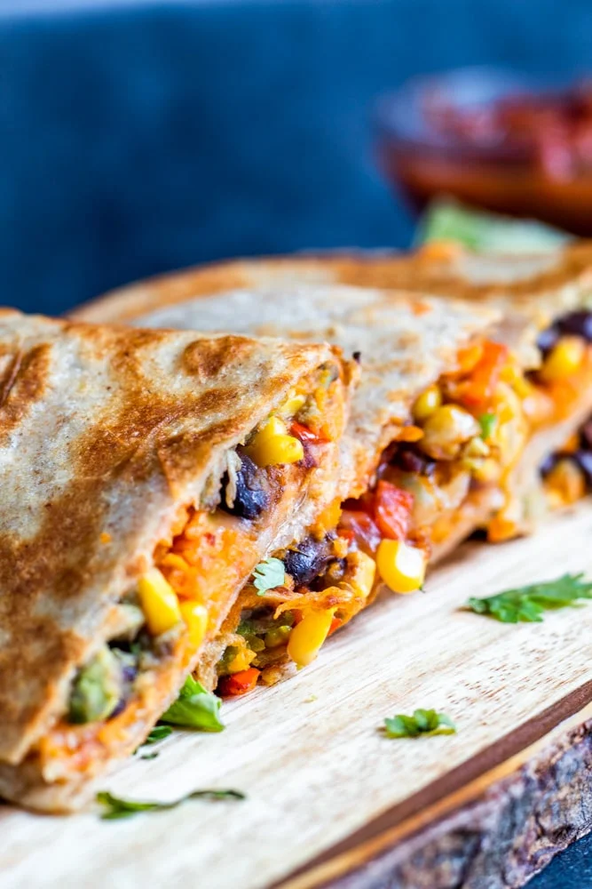

# Vegetarian Quesadillas

**Source:** https://erhardtseat.com/vegetarian-quesadillas/
**Yield:** ['4', '4 Serving']
**Prep time:** PT10M
**Cook time:** PT15M
**Total time:** PT25M
**Category:** ['Main Course', 'Main Dish']
**Cuisine:** ['American', 'Mexican', 'Tex-Mex']
**Rating:** 4.93 (67 ratings/reviews)

These Vegetarian Quesadillas are the best quick weeknight dinner or lunch! Filled with black beans, sweet potato and avocado these are healthy and delicious!

## Ingredients

- 4 Medium Flour Tortillas
- 1 Large Sweet Potato
- 2 Avocados
- 1/2 Cup Black Beans (Rinsed and Drained)
- 1/4 Cup Corn (Rinsed and Drained )
- 1 Mini Red Pepper
- 1 Mini Orange Pepper
- 1 Tsp Jalapeno (Diced-Optional )
- 1 Tbsp Easy Homemade Taco Seasoning (Or Store Bought Mix Packer)
- 1 Cup Cheddar or Pepper Jack Cheese
- 1 Tbsp Butter (For Pan Frying)
- 2 Tsp Olive Oil (Divided )
- Fresh Cilantro
- Lime Juice
- Your Favorite Salsa
- Sour Cream

## Preparation

### Prepare Filling

1. Use a fork to poke several holes into the sweet potato and drizzle with 1 tsp olive oil. You can also sprinkle with a small amount of salt and pepper. Wrap the sweet potato in paper towels and microwave for 8 minutes or until very tender.
2. Dice jalapeno and peppers removing the ribs and seeds. Add diced peppers and jalapeno i(f using) to a large pan and cook until tender, about 5-7 minutes. Then add black beans, corn and taco seasoning and stir to combine cooking another 3 minutes. Pour into a bowl and set aside.
### Assemble the Quesadilla

3. Lightly spread butter over one side of the tortilla. On the other side spread about 3 tbsp of sweet potato over the tortilla. Next mash half of an avocado over the sweet potato. Add about 1/4 cup of the veggie/bean filling over the top of the avocado. Finally sprinkle a generous amount of cheese over top.
4. Place the butter side of the tortilla down on the warm pan and cook over medium heat until tortilla is browned and cheese is melted. Carefully fold tortilla in half on to itself using the spatula. Repeat until all tortillas are filled and cooked. Slice and serve warm with suggested toppings and enjoy!

## Nutrition supplied by source

- **Calories:** 481 kcal
- **Carbohydrate :** 38.7 g
- **Protein :** 12.9 g
- **Fat :** 26.3 g
- **Saturated Fat :** 8.6 g
- **Cholesterol :** 30 mg
- **Sodium :** 459 mg
- **Fiber :** 11.4 g
- **Sugar :** 6.5 g
- **Serving Size:** 1 serving

## Tags

['Main Course', 'Main Dish']; ['American', 'Mexican', 'Tex-Mex']; easy vegetarian quesadillas; healthy vegetarian quesadillas; Vegetarian Quesadillas
